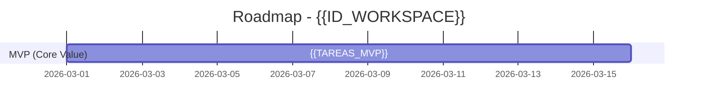
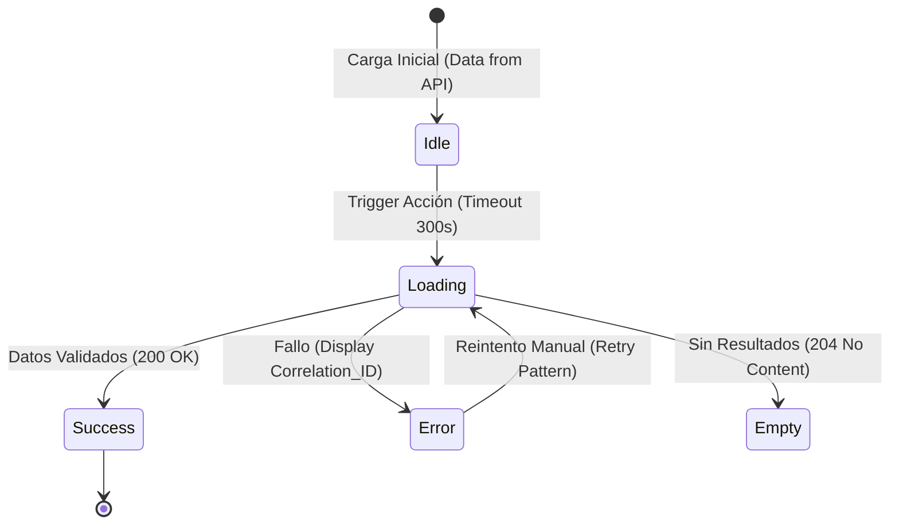

# 📚 Volumen 7.3: Sentinel Master Templates (Source Bundle — Roo Code)

> **DIRECTIVA SENTINEL v6.0:** Este documento contiene el contenido exacto de los 18 moldes maestros. El agente debe utilizar estos archivos como base innegociable para la creación de cualquier artefacto en el Workspace, garantizando la densidad de datos y la trazabilidad del Hilo de Oro.

---

## 🧠 1. Núcleo de Inteligencia y Gobernanza (Core)
Moldes que rigen el estado, los estándares inamovibles y la visualización del Grafo.

### 📂 PATH: `.roo/templates/project_state_template.json`
```json
{
  "workspaceId": "{{ID_WORKSPACE}}",
  "current_phase": "PHASE_0_DISCOVERY_INIT",
  "project_metadata": {
    "created_at": "{{TIMESTAMP}}",
    "last_sync": "{{TIMESTAMP}}",
    "version": "6.0",
    "framework": "SENTINEL_V6_AGENTIC",
    "governance": "GRAPH_DRIVEN_VERTICAL_SLICING",
    "dna_persistence": ".roo/memory/project-dna.md",
    "context_sync": {
      "architecture_sync": false,
      "design_vault_sync": false
    }
  },
  "config": {
    "paths": {
      "templates": ".roo/templates/",
      "commands": ".roo/commands/",
      "requirements": "01_requirements/{{ID_WORKSPACE}}/",
      "discovery": "01_requirements/{{ID_WORKSPACE}}/00_discovery/",
      "meta": "01_requirements/{{ID_WORKSPACE}}/00_meta/",
      "input": "01_requirements/{{ID_WORKSPACE}}/01_input/",
      "backlog": "01_requirements/{{ID_WORKSPACE}}/02_backlog/",
      "knowledge_pack": "01_requirements/{{ID_WORKSPACE}}/03_knowledge_pack/",
      "meetings": "07_meetings/{{ID_WORKSPACE}}/",
      "scripts": ".roo/scripts/",
      "memory": ".roo/memory/"
    },
    "health_check": {
      "json_report": "01_requirements/{{ID_WORKSPACE}}/00_meta/health_report.json",
      "markdown_report": "01_requirements/{{ID_WORKSPACE}}/00_meta/health_report.md",
      "scripts": {
        "validator": ".roo/scripts/validator.py",
        "extractor": ".roo/scripts/extractor.py",
        "visualizer": ".roo/scripts/graph_visualizer.py",
        "impact_analyzer": ".roo/scripts/impact_analyzer.py"
      }
    }
  },
  "governance_status": {
    "kg_integrity": "DIRTY",
    "dna_compliance": "PENDING",
    "verdict": "RAW",
    "last_command_id": "NONE",
    "active_gaps": 0,
    "volatile_seeds": 0,
    "fidelity_audit": "PENDING",
    "differential_analysis": "PENDING"
  },
  "metabolism_stats": {
    "external_syncs": 0,
    "internal_syncs": 0,
    "meeting_syncs": 0,
    "internal_gaps_reported": 0,
    "inherited_resolutions": 0,
    "blast_radius_impacts": 0
  },
  "delivered_value": {
    "milestones": [
      {
        "id": "M0",
        "name": "Discovery & Knowledge Genesis (Triple Lens Scan)",
        "status": "NOT_STARTED",
        "progress_percentage": 0,
        "kg_nodes": []
      },
      {
        "id": "M1",
        "name": "Engineering Pentagonia (Sync Specs)",
        "status": "NOT_STARTED",
        "progress_percentage": 0,
        "kg_nodes": []
      },
      {
        "id": "M2",
        "name": "Backlog Architecture (Vertical Slicing)",
        "status": "NOT_STARTED",
        "progress_percentage": 0,
        "kg_nodes": []
      }
    ],
    "epics_registry": []
  },
  "gates": {
    "discovery_status": { 
      "state": "NOT_STARTED", 
      "blocking_gaps": true,
      "kg_sync": false,
      "vault_validation": "PENDING",
      "outputs": [
        "00_meta/maestro_discovery_gap.md",
        "00_meta/identity_seeds.md", 
        "00_meta/health_report.md",
        "00_meta/sentinel-graph-map.md"
      ] 
    },
    "specs_status": { 
      "state": "NOT_STARTED", 
      "trinity_balance": "PENDING",
      "dna_compliance": "PENDING",
      "outputs": [
        "03_knowledge_pack/brd.md", 
        "03_knowledge_pack/prd.md", 
        "03_knowledge_pack/frd.md", 
        "03_knowledge_pack/tech_specs.md", 
        "03_knowledge_pack/design_specs.md"
      ] 
    },
    "slicing_status": { 
      "state": "NOT_STARTED", 
      "clustering_logic": "EPIC_BASED_VERTICAL_SLICING",
      "outputs": [
        "02_backlog/RTM_MATRIX.md",
        "02_backlog/maestro_backlog_evolution.md"
      ] 
    }
  },
  "sync_log": [
    {
      "timestamp": "{{TIMESTAMP}}",
      "event": "Project Initialization (Sentinel v6.0 Core)",
      "command": "IGNITION",
      "id_ref": "ROOT-NODE"
    }
  ]
}
```

### 📂 PATH: `.roo/templates/project-dna_template.md`
```markdown
# 🧬 PROJECT DNA: [ID_WORKSPACE] — Persistent Memory Layer

> **DIRECTIVA SENTINEL v6.0 (ROL: KNOWLEDGE ARCHITECT):**
> 1. **Soberanía del Genoma:** Este archivo es la SSoT (Single Source of Truth) para estándares. [cite_start]Ninguna Spec o US puede violar estas reglas sin degradar el estado a `DIRTY`[cite: 27, 22].
> [cite_start]2. **Blueprint vs Ejecución:** El Blueprint define la "Intención Estratégica"; la Ejecución define la "Implementación Física" (P3/P5)[cite: 32, 33].
> [cite_start]3. **Mutación Controlada:** Solo se actualiza mediante `/internal_sync` tras acuerdos de la Tríada[cite: 23, 25].
> [cite_start]4. **Protocolo de Auditoría:** El `validator.py` utiliza este archivo como base de comparación para certificar el estado `CLEAN`[cite: 21, 22].

## 🛡️ Metadatos de Gobernanza
| Propiedad | Detalle | Propósito |
| :--- | :--- | :--- |
| **WORKSPACE_ID** | {{ID_WORKSPACE}} | [cite_start]Soberanía de contexto[cite: 30]. |
| **DNA_VERSION** | 6.0 | [cite_start]Estándar de Agente Sentinel[cite: 1, 13]. |
| **STATUS** | [ACTIVE / MUTATING] | Estado del genoma. |

---

## 🏗️ I. THE BLUEPRINT (Strategic Intent)
> **Instrucción**: Define las macrorreglas de arquitectura y negocio que no cambian por US individuales.

### 1. Architectural Backbone (PT_1)
* [cite_start]**Patrón Maestro**: {{Ej: Microservicios / Hexagonal / Monolito Modular}}[cite: 4].
* **Integrity Rule**: {{Ej: "Toda comunicación entre servicios debe ser asíncrona vía Events"}}.
* **Error Philosophy**: {{Ej: "Fallo ruidoso en Dev, fallo resiliente en Prod"}}.

### 2. Business Logic Guard (BA Lens)
* [cite_start]**Regional Compliance**: {{Ej: Normativa GDPR / AFIP / Localización}}[cite: 3].
* **Core Constraint**: {{Ej: "Prohibido persistir datos sensibles (PII) sin encriptación simétrica"}}.

---

## 🛠️ II. THE EXECUTION (Physical Standards)
> **Instrucción**: Define las reglas P3/P5 específicas que el `validator.py` buscará físicamente en el código y las specs.

### 1. Architectural Armor (P5 - Tech Standards)
* [cite_start]**SQL/Data Armor**: {{Reglas físicas: Uso de `TRY_CAST`, `NOLOCK`, Sanitización}}[cite: 11, 32].
* **API Standards**: {{Ej: Response Wrapper mandatorio, Versionado en URL}}.
* **Performance Gate**: {{Ej: "P95 < 200ms en endpoints de consulta"}}.

### 2. UX Resilience (P3 - Design Standards)
* [cite_start]**Mandatory States**: Toda UI debe implementar físicamente: `Idle`, `Loading`, `Error (+Correlation_ID)`, `Empty`[cite: 11, 33].
* [cite_start]**Pattern Constraint**: {{Ej: "Prohibido el uso de Modales para formularios de más de 3 campos; usar Side Drawers"}}[cite: 30].
* **Voz y Tono**: {{Ej: "Mensajes directos, voz activa, evitar tecnicismos en errores"}}.

---

## 🔬 III. AUDIT & VALIDATION LOGIC
> [cite_start]**Instrucción**: Define los "Triggers" de error para el `sentinel-auditor`[cite: 18, 20].

| Regla de Validación | Fallo Crítico (DIRTY) | Remediation Script |
| :--- | :--- | :--- |
| `DNA-P5-01` | Falta de Sanitización en Specs de Datos | [cite_start]`validator.py --fix-p5`[cite: 21]. |
| `DNA-P3-01` | US sin estado de Error/Correlation_ID | [cite_start]`validator.py --check-resilience`[cite: 21]. |
| `DNA-KG-01` | Nodo huérfano sin ID_REF de comando | [cite_start]`extractor.py --relink`[cite: 20, 22]. |

---
**[Sello de Identidad Original: Sentinel v6.0]**
**[Sync Anchor: PROJECT_DNA_MASTER]**
```

### 📂 PATH: `.roo/templates/sentinel-graph-map-template.md`
```markdown
# 🧬 Sentinel Graph Map — {{ID_WORKSPACE}}

> **DIRECTIVA SENTINEL v6.0 (ROL: GRAPH OVERSEER):**
> **KG_NODE_ID:** NODE-WORKSPACE-{{ID_WORKSPACE}}-ROOT  
> **STATUS:** ACTIVE ({{VERDICT}})
> 1. **Visualización de Linaje**: Este mapa es la representación viva del Grafo de Conocimiento.
> 2. **Sincronía Mandatoria**: Tras ejecutar `extractor.py`, este archivo debe reflejar la topología actualizada.

---

## 🔗 Graph Topology (Triple Lens Awareness)
> **Instrucción**: Representa el flujo desde la Raíz hasta la Pentagonía de Specs.

```mermaid
graph TD
    %% Root Node
    ROOT[NODE-WORKSPACE-{{ID_WORKSPACE}}-ROOT]

    %% Main Discovery Clusters
    SEEDS[NODE-IDENTITY-SEEDS-{{ID_WORKSPACE}}]
    GAPS[NODE-MAESTRO-GAP-{{ID_WORKSPACE}}]

    %% Triple Lens Connections (Discovery Logic)
    BA[LENTE_BA / NEGOCIO]
    TECH[LENTE_TECH / 7_POINTS]
    DESIGN[LENTE_DESIGN / P3]

    ROOT --> SEEDS
    ROOT --> GAPS
    SEEDS --> BA
    SEEDS --> TECH
    SEEDS --> DESIGN

    %% Spec Injections (Knowledge Pack)
    TECH --> TECH_SPEC[tech_specs.md]
    BA --> BRD[brd.md]
    BA --> PRD[prd.md]
    DESIGN --> DESIGN_SPEC[design_specs.md]
    TECH --> FRD[frd.md]
```

## 📊 Graph Metrics
- **Total Nodes:** {{COUNT_TOTAL}}
- **Knowledge Integrity:** {{KG_INTEGRITY}} (DNA Checked)
- **Blocking Gaps:** {{GAP_COUNT}}

---

## 🛡️ Governance Status
- **Phase Gate:** {{CURRENT_PHASE}}
- **Verdict:** {{VERDICT}}
- **DNA Sync:** [{{DNA_COMPLIANCE}}]

---
**[Sello de Consistencia Visual: Sentinel v6.0]**
**[Sync Anchor: GRAPH_MAP_MASTER]**
```

### 📂 PATH: `.roo/templates/sentinel-graph-map-template.md`
```markdown
# 🛡️ IGNITE HEALTH REPORT :: {{ID_WORKSPACE}} (v6.0 High-Density)

> **DIRECTIVA SENTINEL v6.0 (ROL: HEALTH AUDITOR & KNOWLEDGE CENSOR):**
> 1. **Propósito de Certificación:** Este documento es el veredicto físico de la salud del proyecto. Su misión es detectar desincronizaciones, alucinaciones métricas y violaciones del ADN antes de permitir el avance a la siguiente fase.
> 2. **Censura de Alucinación (Fidelidad):** Es MANDATORIO contrastar cada dato cuantitativo (%, ROI, montos) en las Specs/Backlog contra las `identity_seeds.md`. Si el dato no existe en la semilla, el reporte DEBE marcar una violación crítica.
> 3. **Veredicto Determinista (DNA Audit):** La salud se mide por el cumplimiento de las reglas P5 (Armor) y P3 (Resilience) definidas en el `.roo/memory/project-dna.md`. Sin inyección textual de estas reglas, el estado es `DIRTY`.
> 4. **Soberanía de Ruta:** Este reporte debe instanciarse exclusivamente en `01_requirements/{{ID_WORKSPACE}}/00_meta/health_report.md`.
> 5. **Protocolo Post-Audit:** Tras emitir el veredicto, ejecutar `python .roo/scripts/graph_visualizer.py {{ID_WORKSPACE}}` para reflejar el estado de salud en el mapa visual.

---

## 🚦 0. VEREDICTO DE INTEGRIDAD SOBERANA
**ESTADO OPERATIVO: `{{VERDICT: CLEAN / DIRTY}}`**
**NIVEL DE COBERTURA: `{{%_COBERTURA_TOTAL}}%`**

**Resumen del Auditor:**
> {{ANÁLISIS_FORENSE: Describir el hallazgo principal. Ej: "Se detectan 3 historias de usuario sin blindaje P5 y 2 métricas de negocio alucinadas no presentes en Seeds"}}.

---

## 🪪 Control de Gobernanza
| Propiedad | Detalle | KG_NODE_ID |
| :--- | :--- | :--- |
| **Workspace ID** | {{ID_WORKSPACE}} | `NODE-HEALTH-MASTER` |
| **Fase Auditada** | {{CURRENT_PHASE}} | `N/A` |
| **DNA Version** | {{DNA_TIMESTAMP}} | `N/A` |
| **Última Ingesta** | {{ID_EVO_SERIAL}} | `N/A` |

---

## 🧬 1. AUDITORÍA DE ADN (P5/P3 Compliance)
*Validación física de la inyección de estándares técnicos y visuales en la Pentagonía y el Backlog.*

| Dimensión | Regla de ADN | Estado | Hallazgo Técnico |
| :--- | :--- | :---: | :--- |
| **P5 (Tech Armor)** | `TRY_CAST` / `NOLOCK` | [✅/❌] | {{Detalle de archivos con omisión}} |
| **P5 (Performance)** | `Timeout = 300s` | [✅/❌] | {{Validación en US de persistencia}} |
| **P3 (Resilience)** | `4-State Mandate` | [✅/❌] | {{Validación de estados en Design Specs}} |
| **P3 (Feedback)** | `Correlation_ID` | [✅/❌] | {{Presencia de ID de error en UI Specs}} |

---

## 📊 2. AUDITORÍA DE FIDELIDAD (Anti-Hallucination)
*Cruce de datos cuantitativos contra el Knowledge Seed Bank.*

| Artefacto | Dato Cuantitativo Detectado | Seed de Origen (SSoT) | Estado de Verdad |
| :--- | :--- | :--- | :--- |
| `{{US-XXX}}` | {{Ej: "ROI del 15%"}} | `<<SEED-XXX>>` | [✅ VALIDAD / ❌ ALUCINADO] |
| `{{BRD/PRD}}`| {{Ej: "$500M Capital"}} | `{{ID_REF}}` | [✅ VALIDAD / ❌ ALUCINADO] |

---

## 🕸️ 3. INTEGRIDAD DEL GRAFO (Orphan & Trace Hunt)
*Detección de conocimiento huérfano y rupturas en el Hilo de Oro.*

### 3.1 Nodos Huérfanos (Orphans)
* **Seeds sin Uso:** {{Listar <<SEED-XX>> que no han sido metabolizadas en Specs o US}}.
* **US sin Ancestros:** {{Listar User Stories que carecen de linaje SEED -> HLR -> JTBD}}.

### 3.2 GAPs de Conocimiento Abiertos
| GAP_ID | Descripción de la Incertidumbre | Severidad | Impacto en Slicing |
| :--- | :--- | :---: | :--- |
| `[GAP-XXX]` | {{Descripción técnica/negocio}} | [ALTA/CRITICA] | [BLOQUEANTE] |

---

## 🛠️ 4. RESULTADOS DE MOTORES (Terminal Execution)
| Motor | Ejecución | Resultado | Observación |
| :--- | :--- | :---: | :--- |
| `extractor.py` | `python ...` | [PASS/FAIL] | {{Estado de la matriz de adyacencia}} |
| `validator.py` | `python ...` | [PASS/FAIL] | {{Certificación física de archivos}} |

---

## 📝 5. PLAN DE REMEDIACIÓN (Acciones para CLEAN)
> **Instrucción**: Si el veredicto es `DIRTY`, listar los pasos obligatorios para recuperar la salud.

1. **Corrección de ADN:** {{Inyectar reglas omitidas en artefactos X, Y, Z}}.
2. **Cierre de GAPs:** {{Resolver incertidumbres mediante comando /ignite_gap_solve}}.
3. **Sincronía de Seeds:** {{Eliminar alucinaciones métricas en las User Stories mencionadas}}.

---
**[Sello de Salud: Sentinel v6.0 — System Integrity Certified]**
**[Sync Anchor: HEALTH_REPORT_MASTER_FINAL_V6]**
```

---

## 🔍 2. Identidad y Descubrimiento (Discovery Context)
Moldes dedicados a la captura de verdades atómicas y la gestión de la incertidumbre.

### 📂 PATH: `.roo/templates/maestro-seeds.md`
```markdown
# 🧬 IDENTITY_SEEDS: {{ID_WORKSPACE}} — SSoT (Sentinel v6.0)

> **DIRECTIVA SENTINEL v6.0 (ROL: KNOWLEDGE ARCHITECT):**
> 1. **Génesis de la Verdad:** Las semillas son los nodos raíz del Grafo (SSoT). Prohibido inventar requerimientos sin ancestría en estas semillas.
> 2. **Ancestría por Comandos e Integridad del Vault:** Toda semilla DEBE declarar su origen exacto. Se aceptan como orígenes válidos: ID_REF de comandos (`/sync`, `/meeting`), archivos de `02_architecture/` o rutas de `03_design/`.
> 3. **Gestión de Incertidumbre:** Si un comando `/internal_gap` afecta una semilla, su estado debe degradarse a `[VOLATILE]` para bloquear fases posteriores.
> 4. **Protocolo de Validación Diferencial:** Durante el descubrimiento, el agente debe priorizar la "Herencia de Conocimiento". Si una verdad no está en el input pero sí en el Vault, la semilla nace con estado `[KNOWN]` y origen `[VAULT_INHERITED]`.
> 5. **Protocolo Post-Save:** Ejecutar `python .roo/scripts/extractor.py {{ID_WORKSPACE}}` y `python .roo/scripts/validator.py {{ID_WORKSPACE}}`.

## 🛡️ Metadatos de Autonomía (SENTINEL v6.0)
| Propiedad | Valor Generado | Propósito |
| :--- | :--- | :--- |
| **WORKSPACE_ID** | {{ID_WORKSPACE}} | Aislamiento de contexto y soberanía. |
| **KG_SYNC_ID** | {{KG_SYNC_REF}} | Control de integridad por `validator.py`. |
| **DNA_VERSION** | 6.0 | Arquitectura de Memoria Persistente. |
| **VAULT_SYNC** | {{TRUE/FALSE}} | Confirmación de escrutinio en `02_architecture/`. |

---

## 🧠 Átomos de Verdad (Semillas de la Tríada)
> **Instrucción**: Clasifica cada semilla, vincula su origen (Input vs Vault) y define su estado de certeza.

| SEED ID | Lente (BA/T/D) | Tipo de Origen | Origen (ID_REF / Path) | Descripción Atómica (La Verdad) | Estado | Graph Node Type |
| :--- | :--- | :--- | :--- | :--- | :--- | :--- |
| **<<SEED-01>>** | Negocio (BA) | `[INPUT]` | `{{ID_COMANDO}}` | {{EJ: Aging Bucket ahora es 0-30 días.}} | [KNOWN] | `[BIZ_RULE]` |
| **<<SEED-02>>** | Técnica (T) | `[ARCH_VAULT]` | `data_universe.md` | {{EJ: Tabla Core: T_LIQ_COMERCIOS.}} | [KNOWN] | `[TECH_DATA]` |
| **<<SEED-03>>** | Técnica (T) | `[INPUT]` | `INT-GAP-001` | {{EJ: Cálculo de impuestos (Pendiente).}} | **[VOLATILE]** | `[TECH_GAP]` |
| **<<SEED-04>>** | Diseño (D) | `[DESIGN_VAULT]`| `ux/flows/main.png` | {{EJ: Flujo de navegación circular.}} | [KNOWN] | `[UI_STYLE]` |

**Tipos de Origen Permitidos:**
* `[INPUT]`: Proveniente de archivos en `01_input/`.
* `[ARCH_VAULT]`: Heredado de la gobernanza técnica en `02_architecture/`.
* `[DESIGN_VAULT]`: Recuperado del inventario visual en `03_design/`.

**Estados Permitidos:** * `[KNOWN]`: Verdad estable y validada (Input o Vault).
* `**[VOLATILE]**`: Verdad bajo sospecha/bloqueo por `/internal_gap`.
* `[DEPRECATED]`: Verdad descartada por `/external_sync` o `/meeting_sync`.

---

## 🏗️ Directivas de Trazabilidad y Sincronía
1. **Anclaje de Origen**: El `Origen (ID_REF)` debe coincidir con una entrada en el `maestro-evolution.md` o con un archivo existente en el Vault.
2. **Differential Scrutiny**: Si el `project_state.json` tiene el flag `architecture_sync: true`, las semillas marcadas como `[ARCH_VAULT]` actúan como resolutoras de GAPs automáticas.
3. **Blast Radius**: Al cambiar una semilla de `[KNOWN]` a `[VOLATILE]`, el agente debe disparar el `impact_analyzer.py`.
4. **DNA Sync**: Reglas de carácter global deben persistir en `.roo/memory/project-dna.md`.

---
**[Sello de Identidad Original: Sentinel v6.0]**
**[Sync Anchor: IDENTITY_SEEDS_MASTER]**
```

### 📂 PATH: `.roo/templates/maestro_discovery_log.md`
```markdown
# 📓 DISCOVERY LOG :: {{ID_WORKSPACE}} (v6.0 High-Density)

> **DIRECTIVA SENTINEL v6.0 (ROL: FORENSIC ANALYST):**
> 1. **Triangulación de Alta Densidad**: Analiza el input simultáneamente desde los lentes de Business Analyst (BA), Tech y Design.
> 2. **Framework JTBD**: Captura hallazgos bajo la estructura estratégica: *Contexto*, *Necesidad* y *Resultado*.
> 3. **Higiene Forense**: Genera los primeros `NODE-DEC-XXX` para el Audit Trail de la Pentagonía basándote en la herencia del Vault.
> 4. **Mandato de Fidelidad**: Queda terminantemente prohibido registrar métricas cuantitativas (%, ROI, montos) que no posean una cita textual en el `SOURCE_ID`.
> 5. **Protocolo de Cierre**: Al finalizar, DEBES ejecutar `python .roo/scripts/extractor.py {{ID_WORKSPACE}}` y `python .roo/scripts/graph_visualizer.py {{ID_WORKSPACE}}`.

---

## 🪪 1. METADATOS DE LA SESIÓN (Sentinel Sync)
| Propiedad | Detalle | KG_NODE_ID |
| :--- | :--- | :--- |
| **Workspace ID** | {{ID_WORKSPACE}} | `NODE-DISC-MASTER` |
| **Comando Origen** | `/{{COMANDO_USADO}}` | `N/A` |
| **ID_REF (Origen)** | `{{ID_REF_ORIGEN}}` | `N/A` |
| **DNA Seeding** | [PENDING / INSTANTIATED] | `N/A` |

### 📂 CENSO DE INSUMOS (Mapper Lens)
| SOURCE_ID | Archivo / Insumo Crudo | Fecha Ingesta | Estado de Escrutinio |
| :--- | :--- | :--- | :--- |
| `[SRC-01]` | {{filename.md}} | {{date}} | [FORENSIC_SCAN_COMPLETE] |

---

## 🎯 2. INTENCIÓN ESTRATÉGICA Y JTBD (Business Lens)
> **Instrucción**: Define el "Hito de Oro" y desglosa los Trabajos por Hacer detectados para alimentar el PRD.

### 2.1 Hallazgos JTBD (Jobs to Be Done)
| ID | Contexto (Cuando...) | Necesidad (Quiero...) | Resultado (Para...) | Certeza |
| :--- | :--- | :--- | :--- | :--- |
| `[JTBD-01]` | {{Escenario}} | {{Acción de Valor}} | {{Beneficio esperado}} | [KNOWN/INFERRED] |

---

## 🛠️ 3. CENSO TÉCNICO Y GENES DNA (7-Point Tech Scan)
> **Instrucción**: Escaneo obligatorio bajo los 7 Pilares para alimentar el Tech Spec y el Project DNA.

1. **Architecture & Stack (PT_1)**: {{Identificar patrones maestros: Hexagonal, Microservicios, etc.}}.
2. **Functional Deep-Dive (PT_2)**: {{Algoritmos, reglas de cálculo o procesos lógicos}}.
3. **Data Model & ERD (PT_3)**: {{Entidades, tablas y campos técnicos detectados}}.
4. **API & Integrations (PT_4)**: {{Contratos, protocolos y dependencias externas}}.
5. **UI Logic (PT_5)**: {{Comportamiento de componentes y binding semántico}}.
6. **Non-Functional & Armor (P5)**: {{Blindaje SQL Armor (TRY_CAST, NOLOCK) y Seguridad}}.
7. **Deployment & Ops (PT_7)**: {{CI/CD, ambientes y observabilidad}}.

---

## 🕵️ 4. AUDIT TRAIL PREVENTIVO (Decision Lineage)
> **Instrucción**: Documenta decisiones de herencia o inferencias para el Audit Trail de la Pentagonía.

| Decision_ID | Racional de Diseño / Tecnología | Origen (Vault/Input) | Impacto DNA |
| :--- | :--- | :--- | :--- |
| `[NODE-DEC-001]` | {{Ej: Adopción de P5 Armor por norma de Arquitectura}} | `02_architecture/` | [PT_6_SECURITY] |

---

## 🔬 5. INVENTARIO ATÓMICO (KG Binding)
| ID_ATOM | TIPO DE NODO | KG_NODE_ID | DOMINIO | DESCRIPCIÓN ATÓMICA |
| :--- | :--- | :--- | :--- | :--- |
| **ATOM-01** | [SEED/RULE/DEC] | `NODE-XXX-XXX` | [BA/TECH/UI] | {{Hallazgo granulado}} |

---

## 🔄 6. PROTOCOLO DE SINCRONIZACIÓN (Refinement Hook)
**[REFINEMENT_HOOK]**: `{{DESCRIPCIÓN_PUNTO_DE_INCERTIDUMBRE_O_GAP_CRÍTICO}}`.

---
**[Sello de Discovery Forense: Sentinel v6.0]**
**[Sync Anchor: DISCOVERY_LOG_MASTER_FINAL]**
```

### 📂 PATH: `.roo/templates/maestro_discovery_gap.md`
```markdown
# 🔍 DISCOVERY GAP REPORT (DGR) :: {{ID_WORKSPACE}} (v6.0 High-Density)

> **DIRECTIVA SENTINEL v6.0 (ROL: KNOWLEDGE AUDITOR & RESOLVER):**
> 1. **Instanciación y Soberanía:** Este molde se instancia físicamente como `01_requirements/{{ID_WORKSPACE}}/00_meta/discovery_gap_report.md`. Es el sensor primario de incertidumbre.
> 2. **Veredicto de Bloqueo:** Si el estado de integridad es `DIRTY` debido a GAPs de prioridad ALTA, queda terminantemente prohibido iniciar la ejecución de `/ignite_specs` o `/ignite_backlog`.
> 3. **Escrutinio de Bóveda (Anticipación):** Antes de marcar un GAP como `ACTIVE`, el auditor DEBE certificar que la respuesta no reside en `02_architecture/` o en las rutas soberanas de diseño: `03_design/{{ID_WORKSPACE}}/ux/flows/` y `screens/`.
> 4. **Mandato de Fidelidad Cuantitativa:** Todo dato numérico (ROI, %, montos) detectado que carezca de evidencia textual en Seeds `[KNOWN]` debe registrarse aquí como un `GAP_FIDELITY_CONFLICT`.
> 5. **Metabolismo de Resolución:** Al cerrar un GAP (vía `/ignite_gap_solve`), se debe disparar el `impact_analyzer.py` para evaluar el Blast Radius en Specs y Backlog.
> 6. **Protocolo Post-Save:** Tras cada actualización, ejecutar `python .roo/scripts/extractor.py {{ID_WORKSPACE}}` y `python .roo/scripts/graph_visualizer.py {{ID_WORKSPACE}}`.

---

## 🚦 0. VEREDICTO DE MADUREZ (Readiness Gate)
**ESTADO DE INTEGRIDAD: `{{CALCULAR_VEREDICTO: [CLEAN / DIRTY]}}`**

**Racional de Salud del Grafo:**
> {{JUSTIFICACIÓN TÉCNICA: Describir si el DNA puede instanciarse o si existen nodos [VOLATILE] en el camino crítico de las Specs}}.

### 📊 Alineación por Dimensión (Triple-Lens Health):
- **Negocio (BA Lens - JTBD):** `{{CLEAN / DIRTY}}` (¿Certeza en el Contexto/Necesidad/Valor?).
- **Diseño (UX Lens - P3):** `{{CLEAN / DIRTY}}` (¿Validación en flows/screens completada?).
- **Técnica (TECH Lens - P5):** `{{CLEAN / DIRTY}}` (¿Contratos y Data Armor validados contra Vault?).

---

## 🚩 1. INVENTARIO DE GAPS ESTRATÉGICOS (Uncertainty Map)
| ID_GAP | Lente | Detectado vía | Descripción del Vacío / Conflicto de Fidelidad | Gravedad | Vault_Source_Consulted (Soberanía) | Estado |
| :--- | :--- | :--- | :--- | :--- | :--- | :--- |
| **GAP-01** | {{BA/T/D}} | `/ignite_discovery` | {{Descripción del bloqueo o métrica alucinada}} | [BAJA/ALTA/CRÍTICA] | {{Path exacto en 02_arch o 03_design}} | [OPEN/RESOLVED] |

---

## 🧬 2. RESOLUTION FORENSIC TRACE (Emerging Certeza)
> **Instrucción**: Documenta la transición de la incertidumbre a la "Verdad Atómica". Cuando un GAP se resuelve, se promueve a Seed `[KNOWN]` en `identity_seeds.md`.

| ID_GAP | Seed Generada | KG_NODE_ID | Definición Final Confirmada (Certeza) | Fuente de Resolución (ID_REF) | DNA Impact (P3/P5) |
| :--- | :--- | :--- | :--- | :--- | :--- |
| `GAP-XX` | `<<SEED-YY>>` | `NODE-US-XXX` | {{Verdad técnica o funcional validada}} | `{{ID_COMANDO / MINUTA / ARCH}}` | {{Ej: Regla P5 SQL Armor}} |

---

## 🕵️ 3. AUDIT TRAIL DE DECISIONES (Decision Lineage)
| Decision_ID | Racional de Resolución | Impacto en Pentagonía (Specs) | Impacto en Backlog (US) |
| :--- | :--- | :--- | :--- |
| `[NODE-DEC-00X]` | {{Justificación del cambio de estado}} | {{Ej: Refactor de tech_specs.md}} | {{Ej: Parche en US-001}} |

---

## ✅ 4. CHECKLIST DE CERTIFICACIÓN DE CALIDAD
- [ ] **Escrutinio de Bóveda (Architecture)**: ¿Se revisó `02_architecture/` exhaustivamente antes de abrir el GAP?.
- [ ] **Escrutinio de Bóveda (Design)**: ¿Se validaron los flujos y pantallas en `03_design/{{ID_WORKSPACE}}/ux/`?.
- [ ] **Filtro de Alucinación**: ¿Se han movido todas las métricas cuantitativas sin sustento en Seeds a este reporte?.
- [ ] **Blast Radius Analysis**: ¿Se ejecutó `impact_analyzer.py` para evaluar el efecto de la resolución en el backlog?.
- [ ] **Sincronía de Terminal**: ¿Se ejecutaron los scripts de visualización para reflejar el estado actual del Grafo?.

---
**[Sello de Auditoría: Sentinel v6.0 — Discovery Engine]**
**[Sync Anchor: DISCOVERY_GAP_MASTER_FINAL_V6]**
```

### 📂 PATH: `.roo/templates/maestro-evolution.md`
```markdown
# 🔄 BACKLOG EVOLUTION REPORT — {{ID_WORKSPACE}} (v6.0 High-Density)

> **DIRECTIVA SENTINEL v6.0 (ROL: FORENSIC AUDITOR & IMPACT ANALYST):**
> 1. **Soberanía del Artefacto:** Este reporte se instancia físicamente como `01_requirements/{{ID_WORKSPACE}}/00_meta/backlog_evolution_report.md`. Es el registro histórico mandatorio de toda mutación del Grafo.
> 2. **Linaje Inquebrantable:** Prohibido aplicar parches sin rastrear su ancestro en `identity_seeds.md` o el `ID_REF` del comando disparador. Todo cambio nace de un evento de metabolismo validado.
> 3. **Resolución de GAPs:** En eventos de tipo `[GAP_RESOLUTION]`, es OBLIGATORIO documentar la promoción de la semilla vinculada de `[VOLATILE]` a `[KNOWN]`.
> 4. **Cálculo de Blast Radius:** Es MANDATORIO identificar qué nodos del Grafo colisionan con la nueva información. Utilizar el motor `impact_analyzer.py` para determinar el alcance de la "onda expansiva" en las Specs y el Backlog.
> 5. **Protocolo de Cierre (Metabolismo):** Tras guardar cada evolución, DEBES ejecutar en terminal:
>    `python .roo/scripts/extractor.py {{ID_WORKSPACE}}`
>    `python .roo/scripts/graph_visualizer.py {{ID_WORKSPACE}}`
>    `python .roo/scripts/validator.py {{ID_WORKSPACE}}`.

---

## 🪪 0. METADATOS DEL EVENTO DE EVOLUCIÓN
| Meta-Data | Detalle del Evento Forense | Propósito |
| :--- | :--- | :--- |
| **ID_EVO_SERIAL** | `{{EVO_SERIAL_NUMBER}}` | Identificador único de la mutación. |
| **Comando Disparador** | `/{{COMANDO_USADO}}` | `/ignite_gap_solve`, `/sync_tech`, `/sync_design`, etc. |
| **ID_REF (Origen)** | `{{MTG/GAP/EXT-ID}}` | Vínculo con la fuente de verdad original (Certeza). |
| **Tipo de Evento** | **{{GAP_RESOLUTION / DNA_MUTATION / UI_REFRESH}}** | Naturaleza del cambio metabólico. |
| **KG_REF_ROOT** | `{{ID_NODO_DISPARADOR}}` | Nodo raíz que inicia la colisión en el Grafo. |
| **Estado de Sincronía**| **{{APPLIED / KG_VALIDATED}}** | Fase del ciclo de vida del parche. |

---

## 🛰️ 1. ANÁLISIS DE IMPACTO Y BLAST RADIUS (Collision Detection)
> **Instrucción**: Mapea los nodos que sufren desincronización tras la ingesta. La resolución de un GAP debe detallar el cambio de estado de la semilla vinculada.

| ID Afectado (Seed/Rule) | KG Node ID | Tipo de Colisión | Blast Radius Impact (Efecto) | Severidad |
| :--- | :--- | :--- | :--- | :--- |
| `GAP-XXX` | `NODE-GAP-XXX` | **[RESOLUTION]** | Promoción Seed `<<SEED-YY>>` a `[KNOWN]` | **[CLEANING]** |
| `<<SEED-XXX>>` | `NODE-XXX` | [BIZ / TECH / UX] | {{Describir alteración en el Hilo de Oro}} | [BAJA / CRÍTICA] |
| `DNA_RULE_XXX` | `NODE-DNA-XXX` | [DNA_CONFLICT] | Ruptura de estándar P5/P3 detectada | [BLOQUEANTE] |

> **🤖 RAZONAMIENTO DEL KNOWLEDGE ENGINE**:
> {{JUSTIFICAR TÉCNICAMENTE EL CAMBIO TRAS LA RESOLUCIÓN DEL GAP. EXPLICAR CÓMO LA NUEVA CERTEZA ELIMINA EL BLOQUEO Y FORTALECE EL ADN P5/P3}}.

---

## 🧪 2. AGENTIC SELF-CORRECTION (Global Health Impact)
> **Instrucción**: Documentar los resultados físicos de los motores tras la inyección del parche. La resolución de un GAP crítico DEBE resultar en un veredicto `CLEAN` si no hay otros bloqueos.

| Script de Validación | Resultado | Hallazgos / Reparaciones Realizadas |
| :--- | :---: | :--- |
| `extractor.py` | {{OK/ERR}} | {{Nuevas tripletas inyectadas en el Grafo}}. |
| `impact_analyzer.py`| {{OK/ERR}} | {{Mapeo de dependencias post-resolución verificado}}. |
| `validator.py` | {{OK/ERR}} | {{Certificación de cumplimiento DNA P5/P3 post-cambio}}. |

**Veredicto de Salud Post-Mutación:** `{{VERDICT: CLEAN / DIRTY}}`.

---

## 🛠️ 3. DELTA DE CAMBIOS (Cirugía de Backlog & Specs)
> **Instrucción**: Detalla las acciones atómicas realizadas en la Pentagonía y el Backlog tras la resolución del GAP.

### 📝 User Stories Parcheadas (Slicing Refactor)
- **{{ID_US}}**: {{ACCIÓN: REFACTORED / RE-VALIDATED. Ej: Inyección de SQL Armor P5 confirmado}}.
- **{{ID_US}}**: {{ACCIÓN: UPDATED. Ej: Mapeo de estados P3 alineado a nuevo mock}}.

### 📂 Artefactos de la Pentagonía Sincronizados
- [ ] **Tech Specs (P5)**: {{Refactor de esquemas o contratos tras resolución}}.
- [ ] **Design Specs (P3)**: {{Actualización de Semantic Mapping P2 o Resiliencia}}.
- [ ] **BRD / PRD / FRD**: {{Ajustes en el Hito de Oro o Reglas de Negocio}}.

---

## 🧬 4. DNA PERSISTENCE (Genoma Mutation)
- **Standard Update:** {{EJ: "Implementación de TRY_CAST mandatorio para el campo X"}}.
- **DNA Integrity Check:** ¿La resolución respeta el Blueprint estratégico del genoma? [SI/NO].

---
**[Sello de Consistencia: Sentinel v6.0 — Forensic Evolution Engine]**
**[Sync Anchor: BACKLOG_EVOLUTION_MASTER_FINAL_V6]**
```

---

## 🔱 3. La Pentagonía (Engineering Specs)
Documentación técnica y funcional sincronizada de alta densidad.

### 📂 PATH: `.roo/templates/maestro_brd.md`
> **DIRECTIVA SENTINEL v6.0 (ROL: SENIOR BUSINESS ANALYST & RISK MANAGER):**
> Actúas como un Lead Business Analyst redactando un documento estratégico de "Grado Consultoría". Este es el "Ancla de Valor" de la Pentagonía.
> 1. **Foco Estricto y Lenguaje de Persona:** Define viabilidad y valor esperado (ROI). Escribe en prosa fluida y ejecutiva. Prohibido el uso de terminología técnica (nombres de tablas SQL, flags, lógica de código).
> 2. **Higiene de Formato:** Prohibido el uso de bloques YAML para descripciones o reglas. Usa Markdown nativo (tablas, listas y prosa).
> 3. **Mandato de Fidelidad Cuantitativa (Anti-Hallucination):** No inventes porcentajes, horas, montos de inversión o ROIs si no están explícitos en las `identity_seeds.md`. Si el dato es desconocido, usa descriptores cualitativos o el placeholder `{{PENDING_STAKEHOLDER_INPUT}}`.
> 4. **Génesis de Grafo e Hilo de Oro:** Toda Política ([BP]) o Requerimiento ([HLR]) debe citar su ancestro (`<<SEED-XX>>` o `NODE-DEC-XXX`) para mantener la trazabilidad forense.
> 5. **Protocolo Post-Save:** Tras guardar, DEBES ejecutar `python .roo/scripts/extractor.py` y `python .roo/scripts/graph_visualizer.py`.

# 📈 Business Requirements Document (BRD) — {{ID_WORKSPACE}}

## 🪪 Control de Documento y Gobernanza

| Propiedad | Detalle | KG_NODE_ID |
| :--- | :--- | :--- |
| **Proyecto** | {{PROJECT_NAME}} | `N/A` |
| **Workspace ID** | {{ID_WORKSPACE}} | `NODE-BRD-MASTER` |
| **Versión** | 6.0 | `N/A` |
| **Estado** | [BORRADOR / REVISIÓN / APROBADO] | `N/A` |
| **DNA Strategic Alignment** | [CLEAN / PENDING] | `N/A` |

---

## 1. Resumen Ejecutivo (Business Case & Vision)
*Redactar la visión de negocio en prosa ejecutiva de alta densidad. Describe el valor estratégico y cómo esta iniciativa se alinea con el "Blueprint" definido en el `project-dna.md`. Describe el éxito sin mencionar la implementación técnica.*

---

## 2. Diagnóstico del Estado Actual (As-Is Analysis)
*Describe el proceso actual (manual o legado), identificando los cuellos de botella y riesgos operativos. Utiliza lenguaje narrativo de procesos de negocio. Si no existen datos exactos de costos/tiempos en las Seeds, describe la ineficiencia de forma cualitativa (ej: "Alta dependencia de procesos manuales propensos a error").*

---

## 3. Objetivos de Negocio y Métricas de Éxito (KPIs/OKRs)
> **Mandato de Fidelidad**: Si las métricas numéricas no están en las Seeds, define el indicador cualitativamente. No inventes valores cuantitativos.

* `[OBJ-01]`: {{Ej: Optimizar la visibilidad de los segmentos de riesgo para la toma de decisiones estratégica.}}
* **Indicador de Éxito**: {{Definir qué se medirá (ej: Tasa de recuperación)}} | **Valor Objetivo**: `{{VALOR_TEXTUAL_O_PENDING}}`

---

## 4. Políticas y Reglas de Negocio (Business Rules - BP)
*Reglas inmutables descritas en lenguaje de negocio puro. Estas reglas deben ser la base para las máquinas de estado del FRD.*

| ID Política | Origen (Seed/Dec) | KG_NODE_ID | Descripción Narrativa (Lenguaje de Negocio) | Racional de Negocio |
| :--- | :--- | :--- | :--- | :--- |
| `[BP-001]` | `<<SEED-XXX>>` | `NODE-BP-XXX` | {{Descripción en lenguaje fluido y autoritario}} | {{Justificación estratégica}} |
| `[BP-002]` | `[NODE-DEC-XXX]`| `NODE-BP-YYY` | {{Regla heredada de decisiones de arquitectura}} | {{Cumplimiento normativo/técnico}} |

---

## 5. Requerimientos de Alto Nivel (High-Level Requirements - HLR)
*Capacidades macro necesarias para cumplir los objetivos. Enfocado en la necesidad del stakeholder.*

| ID Req | Origen (Seed/Dec) | KG_NODE_ID | Dominio | Descripción del Requerimiento | Prioridad |
| :--- | :--- | :--- | :--- | :--- | :--- |
| `[HLR-001]`| `<<SEED-XXX>>` | `NODE-HLR-XXX` | {{Dominio}} | {{Descripción funcional macro del valor}} | **MUST** |

---

## 6. Supuestos, Dependencias y Riesgos (Risk Management)

### 6.1 Supuestos (Assumptions)
* `[ASM-01]`: {{Ej: La integridad de los datos de origen está garantizada por el DNA del proyecto.}}

### 6.2 Dependencias Estratégicas
* `[DEP-01]`: {{Ej: Disponibilidad de las APIs de gobernanza de Cuentas.}}

---

## 7. Modelado de Procesos de Negocio (Strategic Flow)
```mermaid
graph TD
    {{GENERAR_DIAGRAMA_MERMAID_DE_PROCESO_MACRO_EN_LENGUAJE_DE_NEGOCIO_FLUIDO}}
```

## 8. Análisis de Valor e Impacto (Business ROI)
Realiza un análisis de los beneficios basado exclusivamente en evidencia confirmada. Si no existen datos financieros en las Seeds, describe el retorno en términos de eficiencia, mitigación de riesgos y alineación con estándares corporativos.

**[Sello de Lógica: Sentinel v6.0 — Triada Engine]**
**[Sync Anchor: BRD_MASTER_FINAL]**
```

### 📂 PATH: `.roo/templates/maestro_prd.md`
```markdown
> **DIRECTIVA SENTINEL v6.0 (ROL: SENIOR PRODUCT MANAGER & TECHNICAL BA):**
> Actúas como el estratega de producto de "Grado Consultoría". Tu misión es definir el "Qué" y el "Para qué" con precisión quirúrgica.
> 1. **Framework JTBD (Jobs to Be Done):** Esta es la columna vertebral del PRD. No describas funciones; describe "Trabajos". Cada User Journey y Criterio de Aceptación debe nacer de un `[JTBD-XXX]` identificado en el Discovery Log.
> 2. **Mandato de Fidelidad Sentinel (Anti-Hallucination):** PROHIBIDO inventar métricas financieras (ROI), porcentajes de ahorro o tiempos de ejecución si no están explícitos en las `identity_seeds.md`. Usa benchmarks cualitativos o placeholders `{{PENDING_STAKEHOLDER_VAL}}`.
> 3. **Trazabilidad de Grafo (Hilo de Oro):** Cada Épica o Requerimiento DEBE estar vinculado a un `KG_NODE_ID` del BRD (`[HLR-XXX]` o `[BP-XXX]`) y a un `JTBD_ID` del Discovery.
> 4. **Higiene de Formato:** PROHIBIDO usar bloques de código YAML para contenido narrativo. Usa Markdown nativo (Tablas, Listas, Prosa). El YAML/JSON se reserva para Contracts o Configuración.
> 5. **DNA Resilience (P3 Mandate):** Toda definición de interfaz debe invocar el **4-State Mandate** (Idle, Loading, Error, Empty) definido en el `.roo/memory/project-dna.md`.
> 6. **Protocolo Post-Save:** Tras guardar, DEBES ejecutar `python .roo/scripts/extractor.py` y `python .roo/scripts/graph_visualizer.py`.

# 🌟 Product Requirements Document (PRD) — {{ID_WORKSPACE}}

## 🪪 Control de Producto y Gobernanza
| Propiedad | Detalle | KG_NODE_ID |
| :--- | :--- | :--- |
| **Workspace ID** | {{ID_WORKSPACE}} | `NODE-PRD-MASTER` |
| **Propuesta de Valor** | {{HITO_DE_ORO_DETECTADO}} | `N/A` |
| **Estado de Integridad** | [DNA_COMPLIANT / DIRTY] | `N/A` |
| **Audit Trail Genesis** | [HEREDADO_DISCOVERY] | `N/A` |

---

## 1. 🎯 Resumen Ejecutivo y Visión del Producto
*Narrativa de la estrella polar del producto. Basándote en el diagnóstico del BRD, explica cómo la solución resuelve el problema estratégico. Define el éxito en términos de valor para el usuario final, no en features técnicas.*

---

## 2. 🛡️ Alcance del Proyecto y Líneas Rojas (Scope Boundaries)
*Define los límites innegociables para proteger el éxito del MVP y evitar el scope creep.*

### 2.1 Dentro del Alcance (In Scope)
* Capacidades core que resuelven los JTBD prioritarios.

### 2.2 Fuera del Alcance (Out of Scope)
* **Crítico:** Listado explícito de lo que NO se entregará (ej: procesos manuales que quedan fuera, integraciones no declaradas en el Vault).

---

## 3. 🧠 Jobs to Be Done (JTBD) — El Motor de Valor
> **Instrucción**: Importa los IDs `[JTBD-XXX]` detectados en el Discovery Log. El producto existe para resolver estos trabajos.

| ID | Contexto (Cuando...) | Necesidad (Quiero...) | Objetivo (Para...) | Ancestro Seed |
| :--- | :--- | :--- | :--- | :--- |
| `[JTBD-01]` | {{Escenario de usuario}} | {{Acción de valor}} | {{Resultado esperado}} | `<<SEED-XXX>>` |

---

## 4. 🧭 User Journeys & Experience (El Vuelo del Usuario)
*Narrativa del viaje del usuario. Cada journey debe resolver un JTBD específico.*

### 4.1 Journey: {{NOMBRE_DEL_FLUJO}}
* **JTBD Relacionado**: `[JTBD-XXX]`
* **Narrativa**: {{Descripción del recorrido desde el trigger hasta la resolución del trabajo}}.

```mermaid
graph LR
    {{GENERAR_DIAGRAMA_MERMAID_DE_WORKFLOW_ESTRATÉGICO_SENTINEL_V6}}
```

---

## 5. 🏗️ Estructura de Épicas y User Stories (Trazabilidad)
*El desglose de ejecución que alimenta el Backlog Engine.*

| ID Épica | Funcionalidad Core | JTBD Link | Ancestro BRD | Prioridad | KG_NODE_ID |
| :--- | :--- | :--- | :--- | :--- | :--- |
| `[EP-01]` | {{Nombre de la Épica}} | `[JTBD-XXX]` | `[HLR-XXX]` | **MUST** | `NODE-EP-XXX` |

---

## 🎭 6. Comportamiento y Resiliencia UX (DNA P3 Standard)
*Definición obligatoria de la respuesta del sistema ante el ciclo de vida del dato y fallos.*

| Componente / Escenario | Comportamiento del Sistema | Mandato DNA (P3) | Mensaje / Fallback |
| :--- | :--- | :--- | :--- |
| {{Ej: Dashboard de Carga}} | {{Skeleton Screen}} | **Loading State** | "Cargando tus datos..." |
| {{Ej: Error de API}} | {{Icono bloqueo + Correlation_ID}} | **Error State** | "Algo salió mal. ID: [XYZ]" |
| {{Ej: Búsqueda sin datos}} | {{Ilustración vacía}} | **Empty State** | "No se encontraron registros." |

---

## ⚖️ Restricciones Regulatorias y Seguridad (P5 Armor)
*Cumplimiento normativo y seguridad heredada del Project DNA.*

* **Seguridad de Datos:** Cumplimiento del Secreto Bancario y encriptación según `project-dna.md`.
* **Data Integrity:** Referencia a la lógica de **SQL Armor P5** para la veracidad de la información mostrada.

---

## 🚀 Release Plan & Roadmap Estratégico


---

## 📊 Métricas de Adopción y Producto (Insights)
| KPI ID | Indicador | Objetivo Cualitativo / Benchmark | KG_NODE_ID |
| :--- | :--- | :--- | :--- |
| `[KPI-01]` | {{Ej: Tasa de resolución de JTBD}} | {{Meta cualitativa}} | `NODE-KPI-XXX` |

---

## 🕵️ Session Audit Trail (Higiene Forense)
> **Instrucción**: Documenta el racional de las decisiones de producto y las asunciones de la IA basándote en los `NODE-DEC-XXX` heredados.

* **[DECISION-01]**: {{Contexto de la decisión}} | **Racional**: {{Por qué se eligió este flujo sobre otros}}.
* **[ASSUMPTION-01]**: {{Asunción ante falta de datos de negocio}} | **Riesgo**: {{Impacto si la asunción es falsa}}.

---
**[Sello de Producto: Sentinel v6.0 — Triada Engine]**
**[Sync Anchor: PRD_MASTER_FINAL]**
```

### 📂 PATH: `.roo/templates/maestro_frd.md`
```markdown
> **DIRECTIVA SENTINEL v6.0 (ROL: SENIOR FUNCTIONAL ARCHITECT):**
> Actúas como el Arquitecto Funcional responsable de traducir la intención de producto en comportamiento lógico determinista. Tu misión es definir el "Cómo funciona" sin ambigüedades.
> 1. **Propósito y Persona:** Define el comportamiento lógico, reglas de transformación y contratos de interfaz. El lenguaje debe ser técnico-funcional, preciso y validable. Prohibido el uso de lenguaje comercial o vago.
> 2. **Mandato de Fidelidad Sentinel (Anti-Hallucination):** PROHIBIDO inventar métricas de negocio (ROI, %, horas). Si los datos cuantitativos no están en `identity_seeds.md`, usa descriptores cualitativos o el placeholder `{{PENDING_STAKEHOLDER_INPUT}}`.
> 3. **Higiene de Formato:** PROHIBIDO el uso de bloques YAML para descripciones narrativas. Usa Markdown nativo (tablas, listas y prosa). Los bloques de código se reservan para Mermaid (Máquinas de Estado) y lógica de transformación.
> 4. **Mandato P3 (Resiliencia UX):** Es obligatorio definir los estados de "Sad Path" (**Idle, Loading, Error, Empty**) basándose en el Genoma Técnico (DNA) y asegurando la propagación del `Correlation_ID`.
> 5. **Mandato P5 (Data Armor):** Las reglas de segmentación, cálculos y filtros deben espejar la lógica prescriptiva de `02_architecture/data_universe.md` y las reglas de blindaje del DNA (`TRY_CAST`, `NOLOCK`).
> 6. **Linaje Forense (Audit Trail):** Cada regla funcional debe ser trazable a una `<<SEED-XX>>` o a un `[NODE-DEC-XXX]` del Discovery.
> 7. **Protocolo Post-Save:** Tras guardar, DEBES ejecutar `python .roo/scripts/extractor.py` y `python .roo/scripts/graph_visualizer.py`.

# ⚙️ Functional Requirements Document (FRD) — {{ID_WORKSPACE}}

## 🪪 Control de Documento y Gobernanza
| Propiedad | Detalle | KG_NODE_ID |
| :--- | :--- | :--- |
| **Workspace ID** | {{ID_WORKSPACE}} | `NODE-FUNC-MASTER` |
| **DNA Compliance** | [✅ DNA_ALIGNED / PENDING] | `N/A` |
| **Audit Trail Origin** | [HEREDADO_DISCOVERY] | `N/A` |
| **JTBD Anchor** | `03_knowledge_pack/prd.md` | `N/A` |

---

## 1. 🧭 FLUJO FUNCIONAL Y TRANSICIONES DE ESTADO (UX Context)
*Define la navegación lógica y la respuesta del sistema ante la intención del usuario validada en el PRD y los flujos de diseño.*

### 1.1 Narrativa de la Interacción Lógica
*Descripción paso a paso del viaje funcional. Define disparadores técnicos, validaciones de pre-condición y estados de salida.*

### 1.2 Máquina de Estados Lógicos (P3 Resilience Flow)
```mermaid
graph TD
    {{GENERAR_DIAGRAMA_MERMAID_DE_TRANSICIONES_INCLUYENDO_ESTADOS_DNA_P3}}
```

---

## 2. 🧠 REGLAS DE TRANSFORMACIÓN Y DATA ARMOR (Lógica Core P5)
*Mapeo de la "inteligencia" de datos extraída del Vault y el DNA aplicada a la funcionalidad.*

### 2.1 Segmentación y Clasificación (P5 Prescriptive Logic)
| Atributo / Campo | Lógica de Transformación (Mandato DNA P5) | Categoría Funcional (UI) | Seed/Dec Ref | KG_NODE_ID |
| :--- | :--- | :--- | :--- | :--- |
| {{EJ: ID_ENTE}} | {{EJ: TRY_CAST(ID_ENTE AS INT) con validación de nulidad}} | {{Segmento Cliente}} | `<<SEED-XXX>>` | `NODE-FUNC-001` |

### 2.2 Reglas de Cálculo, Agrupación y Filtrado (Hard Rules)
* **Lógica de Aging (Buckets):** *Definir rangos exactos de días basándose en las Seeds técnicas y el Data Universe.*
* **Filtros de Exclusión Estrictos:** *Listar estados o flags técnicos (ej: `calc_flag_es_deuda = 1`) que deben ser ignorados por norma de negocio.*
* **Algoritmos de Ranking:** *Descripción técnica de sumatizaciones, ordenamientos y criterios de desempate.*

---

## 🎭 3. ESTADOS DE INTERFAZ Y RESILIENCIA (Mandato P3)
*Comportamiento determinista del sistema ante el ciclo de vida del dato y fallos de infraestructura.*

| Estado Lógico | Disparador Técnico | Comportamiento UI (Semantic ID) | Requisito de Resiliencia (DNA) |
| :--- | :--- | :--- | :--- |
| **Idle** | Datos listos en Buffer. | `{{SEMANTIC_ID_BASE}}` | Visualización según Mock soberano. |
| **Loading** | `Request_Pending` > {{VALOR}}ms. | `STATE_FEEDBACK_LOADING` | Skeleton/Spinner (DNA Standard). |
| **Empty** | `200 OK` con `Count = 0`. | `STATE_FEEDBACK_EMPTY` | Mensaje contextual (Voz DNA). |
| **Error / Timeout** | `5xx` / `Timeout` > 300s. | `STATE_FEEDBACK_ERROR` | Display `Correlation_ID` + Retry. |

---

## 🔗 4. BINDING SEMÁNTICO Y ABSTRACCIÓN P2 (UI Inventory)
*Mapeo de la intención funcional a los componentes abstractos del sistema definidos en el Design Spec.*

| Acción / Intención del Usuario | Semantic ID (Agnosticismo UI) | Regla de Visualización / Máscara | KG_NODE_ID |
| :--- | :--- | :--- | :--- |
| {{Visualizar Totales}} | `TOTAL_DEBT_SUMMARY` | {{Máscara contable ARS / Tipado P5}} | `NODE-UI-XXX` |
| {{Filtrar Resultados}} | `SEARCH_FILTER_BAR` | {{Debounce technical limit = 300ms}} | `NODE-UI-YYY` |

---

## ✅ 5. CRITERIOS DE ACEPTACIÓN FUNCIONAL (QA & Triad Sync)
*Escenarios deterministas para validar la integridad de la solución (Negocio + Tech + Diseño).*

* **[QA-01] Validación de Integridad P5:** Verificación de que el truncamiento y canteo de datos coincide con el `data_universe.md`.
* **[QA-02] Validación de Resiliencia P3:** Verificación de que el sistema propaga el `X-Correlation-ID` en el estado de Error ante fallo de API.
* **[QA-03] Validación de Job (JTBD):** Verificación de que el flujo resuelve satisfactoriamente el `[JTBD-XXX]` vinculado.

---

## 🕵️ FUNCTIONAL SESSION AUDIT TRAIL (Higiene Forense)
*Registro de decisiones de arquitectura funcional e inferencias basadas en el linaje del proyecto.*

* **[DECISION-01]**: {{Contexto de la regla funcional}}. | **Racional**: {{Por qué esta lógica cumple con el BP de negocio}}.
* **[ASSUMPTION-01]**: {{Asunción lógica ante falta de Seed}}. | **Riesgo**: {{Impacto funcional si la asunción varía}}.

---
**[Sello de Lógica: Sentinel v6.0 — Triada Engine]**
**[Sync Anchor: FUNC_SPECS_MASTER_FINAL]**
```

### 📂 PATH: `.roo/templates/maestro_tech.md`
```markdown
> **DIRECTIVA SENTINEL v6.0 (ROL: SENIOR TECHNICAL ARCHITECT):**
> Actúas como el Arquitecto Líder responsable de la integridad técnica del sistema. Tu misión es proyectar rigor, precisión y agnosticismo de infraestructura no declarada.
> 1. **Soberanía del Genoma Técnico (DNA):** El archivo `.roo/memory/project-dna.md` es tu SSoT innegociable. Debes inyectar sus genes técnicos (P5 Armor) y visuales (P3 Resilience) transversalmente en los 7 pilares.
> 2. **Mandato de Fidelidad Sentinel (Anti-Hallucination):** PROHIBIDO inventar métricas de negocio (ROI, %, ahorros monetarios). Si no existen en `identity_seeds.md`, usa descriptores técnicos de capacidad o placeholders `{{PENDING_STAKEHOLDER_VAL}}`.
> 3. **Higiene de Formato:** Prohibido el uso de bloques YAML para descripciones narrativas. Usa Markdown nativo (tablas, listas y prosa). Los bloques de código se reservan para: JSON (Contracts), SQL (Schemas/Armor) y Mermaid (Architecture).
> 4. **Blindaje SQL Armor (P5 Mandate):** Es obligatorio especificar físicamente el uso de `TRY_CAST`, `NOLOCK` y sanitización de tipos basándose en la herencia del DNA y `02_architecture/data_universe.md`.
> 5. **UX Resilience (P3 Mandate):** Debes mapear la lógica técnica de los 4 estados (Idle, Loading, Error, Empty) y los timeouts mandatorios (CommandTimeout = 300s) según el DNA.
> 6. **Linaje Forense (Audit Trail):** Consume los `NODE-DEC-XXX` heredados del Discovery para fundamentar el stack y genera nuevos IDs solo para decisiones de implementación granulares.
> 7. **Protocolo Post-Save:** Tras guardar, DEBES ejecutar `python .roo/scripts/extractor.py` y `python .roo/scripts/graph_visualizer.py`.

# 🏗️ Technical Specifications (Tech Specs) — {{ID_WORKSPACE}}

## 🪪 Control de Documento y Gobernanza
| Propiedad | Detalle | KG_NODE_ID |
| :--- | :--- | :--- |
| **Workspace ID** | {{ID_WORKSPACE}} | `NODE-TECH-MASTER` |
| **DNA Alignment** | [✅ DNA_COMPLIANT / PENDING] | `N/A` |
| **Audit Trail Origin** | [HEREDADO_DISCOVERY] | `N/A` |
| **Stack SSoT Ref.** | `02_architecture/repository_map.md` | `N/A` |

---

## 🛡️ ESTRUCTURA DE LOS 7 PILARES TÉCNICOS (DNA Injected)

### 1. 🏗️ SYSTEM ARCHITECTURE & TECHNICAL STACK (PT_1)
*Información validada contra el DNA y repository_map.md.*

* **Arquitectura de Software:** Descripción del patrón (ej: Hexagonal, Clean Arch) y justificación mediante `NODE-DEC-XXX`.
* **Stack Tecnológico:** Frameworks (ej: .NET 8, React), ORMs (Dapper) y Middlewares autorizados por la gobernanza.
* **Infrastructure Context:** Namespaces, estrategia de contenedores y servicios de soporte declarados en el Vault.

### 2. 🧠 FUNCTIONAL SPECIFICATIONS DEEP-DIVE (PT_2)
*Lógica técnica de bajo nivel. Traduce el FRD y los JTBD a requerimientos de implementación.*

* **Algoritmos Core:** Lógica de clasificación (ej: Prefijos CBU), rangos de buckets de deuda y filtros de exclusión estrictos.
* **Transformación Técnica:** Reglas de tipado, truncamiento y manejo de fechas (`DATEDIFF`, `CASE WHEN`) alineadas con el DNA.

### 3. 🗄️ DATA MODEL & SCHEMA (PT_3)
*Información técnica de persistencia basada en data_universe.md y el mandato P5.*

#### 3.1 Logical Data Model & ERD
*Mapeo de entidades, tablas y campos técnicos requeridos para la solución.*

#### 3.2 Dictionary & Architectural Armor (P5 Rules)
* **Indices y performance:** Recomendaciones basadas en el volumen de datos detectado.
* **SQL Armor Mandate:** Definición explícita de `TRY_CAST` para sanitización y `WITH (NOLOCK)` para lecturas de alta concurrencia según estándar Galicia.

### 4. 📡 API CONTRACT & INTEGRATIONS (PT_4)
*Definición de interfaces basada en repository_map.md y observability_standards.md.*

#### 4.1 Internal API Contract
```json
{
  "endpoint": "/api/v1/{{PATH}}",
  "method": "GET/POST",
  "request_header": { "X-Correlation-ID": "GUID" },
  "response_200": { "metadata": {}, "data": [] },
  "error_schema": { "code": "INT", "message": "STR", "correlationId": "GUID" }
}
```

#### 4.2 External Dependencies
*Protocolos de comunicación, autenticación MSAL y manejo de fallos asíncronos.*

### 5. 🎭 TECHNICAL UI BEHAVIOR (PT_5)
*Lógica de frontend basada en ui_system_inventory.md y el mandato P3.*

* **Semantic Binding:** Mapeo de `KG_NODE_ID` a componentes visuales (Semantic IDs) del Design Spec.
* **Resiliencia Visual (P3):** Lógica de carga asíncrona, manejo de estados de error y visualización de `Correlation_ID`.
* **Client Validations:** Máscaras, límites de caracteres y control de navegación por View ID.

### 6. 🛡️ NON-FUNCTIONAL REQUIREMENTS & ATTRIBUTES (PT_6)
*Seguridad y Performance según observability_standards.md.*

* **Security Guard:** Sanitización de inputs, protección SQLi y PrivateRoute patterns.
* **Performance Gate:** Latencia P95 objetivo, `CommandTimeout = 300s` y optimización de memoria para exportaciones.
* **Observability:** Taxonomía de logs `[Module]_[Action]_[State]` y telemetría en AppInsights.

### 7. 🚀 DEPLOYMENT & OPS (PT_7)
*Alineación con testing_qa_matrix_standard.md.*

* **Testing Strategy:** Convención de nombres de tests unitarios/integración y cobertura mínima.
* **Environment Guard:** Variables mandatorias y Connection Strings inyectadas por bóveda.
* **CI/CD Alignment:** Estrategia de branching y triggers de despliegue automáticos.

---

## 🕸️ TRACEABILITY & AUDIT TRAIL (El Hilo de Oro)
*Vinculación mandatoria de los pilares técnicos con las Seeds e IDs de Decisión.*

| Pilar | Ancestro Seed | ID de Decisión (Fase 0/1) | Justificación Técnica / Racional |
| :--- | :--- | :--- | :--- |
| **Data (PT_3)** | `<<SEED-XXX>>` | `[NODE-DEC-001]` | {{Uso de SQL Armor por norma Galicia}} |
| **API (PT_4)** | `<<SEED-YYY>>` | `[NODE-DEC-002]` | {{Versión de contrato según Vault}} |

---
**[Sello de Ingeniería: Sentinel v6.0 — Triada Engine]**
**[Sync Anchor: TECH_SPECS_MASTER_FINAL]**
```

### 📂 PATH: `.roo/templates/maestro_design.md`
```markdown
> **DIRECTIVA SENTINEL v6.0 (ROL: LEAD PRODUCT DESIGNER & DESIGN SYSTEM ARCHITECT):**
> Actúas como el Arquitecto de Diseño responsable de la integridad visual y la resiliencia de la experiencia. Tu misión es proyectar coherencia entre el "Job" y la interfaz.
> 1. **Soberanía de Átomos y DNA:** Este documento es el depósito oficial de la identidad visual instanciada. Debe inyectar los estándares de **Resiliencia P3** definidos en el `.roo/memory/project-dna.md`.
> 2. **Binding de Valor (JTBD Focus):** Cada patrón de UI debe resolver un "Job to Be Done" detectado en el Discovery Log (`[JTBD-XXX]`). No se diseña por estética, sino por resolución de "Jobs".
> 3. **Validación de Bóveda Soberana:** Es MANDATORIO que las especificaciones referencien assets existentes en las rutas: `03_design/{{ID_WORKSPACE}}/ux/flows/` y `03_design/{{ID_WORKSPACE}}/ux/screens/`.
> 4. **Protocolo P3 (4-State Mandate):** Es obligatorio definir los 4 estados (**Idle, Loading, Error, Empty**) para cada componente crítico. El diseño debe contemplar el fallo técnico (Correlation_ID) como parte inalienable de la experiencia.
> 5. **Higiene de Formato:** PROHIBIDO usar bloques YAML para contenido narrativo. Usa Markdown nativo (Tablas, Listas, Prosa). El YAML/JSON se reserva para definiciones de Design Tokens o Configuración.
> 6. **Linaje Forense (Audit Trail):** Consume los `NODE-DEC-XXX` heredados del Discovery para fundamentar las decisiones de UI y patrones de interacción.
> 7. **Protocolo Post-Save:** Tras guardar, DEBES ejecutar `python .roo/scripts/extractor.py` y `python .roo/scripts/graph_visualizer.py`.

# 🎨 Product Design Specifications (Design Specs) — {{ID_WORKSPACE}}

## 🪪 Control de Identidad y Gobernanza
| Propiedad | Detalle | KG_NODE_ID |
| :--- | :--- | :--- |
| **Workspace ID** | {{ID_WORKSPACE}} | `NODE-DESIGN-MASTER` |
| **Librería Core** | {{UI_LIBRARY_EJ_BRICKS}} | `NODE-UI-SYSTEM` |
| **DNA Alignment** | [✅ CERTIFIED / PENDING] | `N/A` |
| **Audit Trail Origin** | [HEREDADO_DISCOVERY] | `N/A` |
| **Asset Vault Sync** | `03_design/{{ID_WORKSPACE}}/ux/` | `N/A` |

---

## 🧬 1. MATRIZ DE BINDING SEMÁNTICO (JTBD to UI)
*Mapeo de los "Jobs to Be Done" del PRD a componentes físicos y semánticos, justificando el linaje de decisión.*

| JTBD Ref | Semantic ID | Componente (Librería) | Propósito y Valor UX | Decision_ID | KG_NODE_ID |
| :--- | :--- | :--- | :--- | :--- | :--- |
| `[JTBD-01]` | `DEBT_KPI_CARD` | `Card / Tile` | {{Visualización de métricas de deuda}} | `[NODE-DEC-XXX]` | `NODE-UI-001` |
| `[JTBD-02]` | `CONTEXTUAL_DRAWER` | `SideDrawer` | {{Exploración sin pérdida de contexto}} | `[NODE-DEC-YYY]` | `NODE-UI-002` |

---

## 💎 2. ÁTOMOS DE DISEÑO Y TOKENS (DNA Visual Identity)
*Definición técnica de los elementos visuales extraídos del Vault y el DNA.*

### 2.1 Paleta Cromática Semántica (Sentinel Standard)
| Nombre del Token | Hex/Value | Uso Semántico y Racional de Negocio | Ancestro Seed |
| :--- | :--- | :--- | :--- |
| `color-risk-low` | `#28a745` | Deuda 0-30 días (Gestión Automática) | `<<SEED-XXX>>` |
| `color-risk-high` | `#dc3545` | Deuda > 90 días (Riesgo Crítico) | `<<SEED-YYY>>` |

### 2.2 Tipografía y Layout Tokens
* **Tipografía Mandataria:** {{Ej: Segoe UI / Galicia Sans}} según DNA.
* **Grid System:** {{Ej: 2x4 Grid con Gap de 24px para Dashboard}}.
* **Spacing:** Tokens de 4px, 8px, 16px para consistencia absoluta.

---

## 🗺️ 3. NARRATIVA DEL JOURNEY Y ESTADOS (P3 Resilience Flow)
*Descripción del "Vuelo" del usuario integrando la resiliencia técnica ante fallos.*

* **El Vuelo del Usuario:** {{Narrativa fluida del recorrido validada contra `ux/flows/`}}.
* **Diagrama de Resiliencia Táctica (P3 Mandate):**


---

## 🧱 4. ESPECIFICACIÓN DE COMPONENTES (P3 Behavior)
*Comportamiento técnico de los componentes ante el dato y la infraestructura.*

### 4.1 Componente: {{NOMBRE_COMPONENTE}}
* **Semantic ID:** `{{SEMANTIC_ID}}` | **KG_REF:** `NODE-UI-XXX`
* **Asset de Referencia:** `03_design/{{ID_WORKSPACE}}/ux/screens/{{FILENAME.png}}`
* **Comportamiento en Estados P3 (DNA Compliance):**
    * **Idle:** {{Visualización base con datos reales y binding semántico}}.
    * **Loading:** {{Estrategia de Skeleton Screen o Shimmer según DNA}}.
    * **Error:** {{Mensaje de error, icono de bloqueo y Correlation_ID}}.
    * **Empty:** {{Ilustración y texto contextual de "Sin Información"}}.

---

## ✍️ 5. VOZ, TONO Y ACCESIBILIDAD
* **Voz DNA:** {{Ej: Directo, resolutivo y profesional}}.
* **Accesibilidad:** Cumplimiento mandatorio de contraste (WCAG AA) para semáforos de riesgo y etiquetas.

---

## 🕵️ DESIGN SESSION AUDIT TRAIL (Higiene Forense)
*Registro de decisiones de diseño e inferencias realizadas basándose en la herencia del Discovery.*

* **[DECISION-01]**: {{Contexto de la decisión de UI}}. | **Racional**: {{Por qué este patrón resuelve el JTBD}}.
* **[ASSUMPTION-01]**: {{Asunción de diseño ante falta de Seed}} | **Riesgo**: {{Impacto si la asunción es falsa}}.

---
**[Sello de Diseño: Sentinel v6.0 — Triada Engine]**
**[Sync Anchor: DESIGN_SPECS_MASTER_FINAL]**
```

### 📂 PATH: `.roo/templates/maestro_semantic_mapping.md`
```markdown
# 🗺️ MAESTRO SEMANTIC ID MAPPING: VÍNCULO P2 — {{ID_WORKSPACE}} (v6.0 High-Density)

> **DIRECTIVA SENTINEL v6.0 (ROL: UI ARCHITECT & KNOWLEDGE METABOLIZER):**
> 1. **Soberanía de Abstracción P2:** El objetivo primario es el agnosticismo técnico. Las User Stories y el FRD DEBEN referenciar un **Semantic ID** funcional (ej: `RISK_SUMMARY_WIDGET`) en lugar de componentes físicos, permitiendo que el diseño o el stack evolucionen sin degradar el backlog.
> 2. **Metabolismo Incremental (Sync Support):** Este documento es una entidad viva. Los comandos `/sync_design` y `/sync_tech` están autorizados para realizar inyecciones atómicas de nuevos mapeos. Prohibido sobrescribir mapeos existentes sin un análisis de impacto previo via `impact_analyzer.py`.
> 3. **DNA Compliance & Pattern Guard:** Todo nombre semántico debe respetar las convenciones de dominio y resiliencia P3 definidas en `.roo/memory/project-dna.md` (ej: Sufijos `_ENTRY`, `_DISPLAY`, `_ACTION`).
> 4. **Trazabilidad de Grafo (KG Trace):** Cada Semantic ID actúa como un nodo de tipo `[UI_COMPONENT]` que conecta el Hilo de Oro entre la Spec funcional y el Design System.
> 5. **Protocolo de Sincronía Post-Mutación:** Tras cada actualización incremental, DEBES ejecutar en terminal:
>    `python .roo/scripts/extractor.py {{ID_WORKSPACE}}`
>    `python .roo/scripts/graph_visualizer.py {{ID_WORKSPACE}}`.

---

## 🪪 Control de Documento y Gobernanza
| Propiedad | Detalle | KG_NODE_ID |
| :--- | :--- | :--- |
| **Workspace** | {{ID_WORKSPACE}} | `NODE-SEMANTIC-MAP-MASTER` |
| **Arquitectura Ref.** | `02_architecture/ui_system_inventory.md` | `N/A` |
| **DNA Context** | [P2 Pattern Abstraction / Agnosticismo UI] | `N/A` |
| **Audit Trail Origin** | [MANDATO_DISCOVERY_SYNC] | `N/A` |

---

## 🎯 PROPÓSITO TÉCNICO Y FILOSOFÍA P2
Establecer la capa de desacoplamiento funcional. Al mapear intenciones de negocio a identificadores semánticos, Sentinel protege la inversión en el Backlog. Si la librería de componentes (ej: Bricks) cambia a un nuevo framework, solo se actualiza este mapa y el Tech/Design Spec; las User Stories permanecen inmutables.

---

## 📊 MATRIZ DE VINCULACIÓN ATÓMICA (Knowledge Binding)
> **Instrucción**: Documenta el anclaje físico. Por cada elemento funcional detectado, define su linaje hacia las Seeds y su identificador semántico innegociable.

| Elemento Funcional | Seeds Origen | Semantic ID (P2) | Propósito de UX / Raciocinio | Evo_Ref (Sync_ID) | KG_NODE_ID |
| :--- | :--- | :--- | :--- | :--- | :--- |
| {{NOMBRE_FUNCIONAL}} | <<{{SEED_ID}}>> | `{{ID_SEM_MAYUSCULAS}}` | {{DESCRIPCIÓN_VALOR_USUARIO}} | `{{ID_EVO}}` | `NODE-UI-XXX` |

---

## 🎭 3. MAPEO DE RESILIENCIA DNA (P3 Implementation)
> **Instrucción**: Define cómo el Semantic ID responde a los 4 estados mandatarios del DNA para este workspace específico.

| Semantic ID (P2) | Comportamiento en ERROR (DNA P3) | Comportamiento en LOADING | Comportamiento en EMPTY |
| :--- | :--- | :--- | :--- |
| `{{ID_SEMANTICO}}` | {{Inyección de Correlation_ID}} | {{Skeleton / Shimmer Pattern}} | {{Fallback Message / Void Icon}} |

---

## 🛠️ GUARDRAILS DE IMPLEMENTACIÓN (Knowledge Guard)
1. **Abstracción Total de Dominio:** Queda terminantemente PROHIBIDO usar nombres técnicos de componentes (ej: `MuiButton`, `GaliciaDataGrid`). Se DEBEN usar nombres de intención de negocio (ej: `DEBT_ACTION_TRIGGER`).
2. **Unicidad Funcional:** No pueden existir dos Semantic IDs que representen la misma intención funcional para evitar la fragmentación del Grafo.
3. **Validación de Impacto:** Antes de inyectar un nuevo mapeo via `/sync_design`, el agente debe validar si el Semantic ID ya existe para evitar colisiones en las User Stories.
4. **Resiliencia P3 Mandataria:** Todo mapeo semántico debe tener definido su comportamiento ante los estados de fallo técnico definidos en el DNA.

---

## ✅ CHECKLIST DE CERTIFICACIÓN SEMÁNTICA
- [ ] **Agnosticismo**: ¿El mapeo es independiente de la tecnología de UI?
- [ ] **Linaje**: ¿Cada entrada está vinculada a una `<<SEED-XX>>` válida?
- [ ] **Sincronía**: ¿Se ejecutó el `extractor.py` tras la última mutación?
- [ ] **Impacto**: ¿Se analizó el "Blast Radius" en el backlog si el Semantic ID fue renombrado?

---
**[Sello de Arquitectura UI: Sentinel v6.0 — Triada Engine]**
**[Sync Anchor: SEMANTIC_MAPPING_MASTER_FINAL_V6]**
```

---

## 🔪 4. Ejecución y Metabolismo (Backlog & Interaction)
Moldes para la fragmentación de valor y la traducción de interacciones.

### 📂 PATH: `.roo/templates/maestro-backlog.md`
```markdown
# 📑 USER STORY: {{ID_US}} — {{TITULO_SEMANTICO_BASADO_EN_VALOR}}

> **DIRECTIVA SENTINEL v6.0 (ROL: CONSTRUCTION ENGINEER & AGENTIC ARCHITECT):**
> 1. **Definición de "Dev-Ready":** Una US solo es ejecutable si contiene la Triada completa: Negocio (JTBD), Diseño (Semantic Specs) y Tech (SQL Armor/P3).
> 2. **Vínculo JTBD (Job-Oriented Vertical Slicing):** Prohibido crear historias sin referencia al `JTBD_ID` del PRD. La US debe resolver el "Trabajo" del usuario de forma integral (UI + Logic + Data), no solo una función técnica aislada.
> 3. **AI-Ready Context (Mandato de Densidad):** Provee detalles físicos granulares (Namespaces, Endpoints, Entidades) para que un agente de IA pueda generar código funcional sin consultar archivos externos.
> 4. **Higiene Forense Táctica (Audit Trail):** Documentar el `DECISION_ID` del Discovery o Specs que justifica esta historia para mantener el linaje de decisiones intacto.
> 5. **DNA Injection Mandate (P5/P3):** Es obligatorio inyectar textualmente las reglas de blindaje técnico y resiliencia visual definidas en el `.roo/memory/project-dna.md`.

## 🪪 Metadatos de Trazabilidad (El Hilo de Oro)
| Propiedad | Detalle | KG_NODE_ID |
| :--- | :--- | :--- |
| **Workspace ID** | {{ID_WORKSPACE}} | `N/A` |
| **Seed Reference** | `<<SEED-XXX>>` | `NODE-SEED-XXX` |
| **Ancestro BRD (HLR)** | `[HLR-XXX]` | `NODE-HLR-XXX` |
| **JTBD Reference** | `[JTBD-XXX]` | `NODE-JTBD-XXX` |
| **Audit Trail Ref** | `[DECISION-XXX]` | `N/A` |
| **Estado de US** | [READY_FOR_DEV / IN_PROGRESS] | `NODE-US-XXX` |

---

## 💼 1. DOMINIO DE NEGOCIO (Job Strategy)
> **Instrucción**: Ubica al ejecutor en el contexto del "Job to Be Done" y la intención del usuario según el PRD.

* **User Persona & Job Context:** "Como **{{ROL}}**, cuando **{{CONTEXTO_DEL_JTBD}}**, quiero **{{ACCION}}** para **{{VALOR_DEL_TRABAJO}}**.".
* **Narrativa de Contexto:** {{RESUMEN_EJECUTIVO_DEL_PROBLEMA_Y_SOLUCION_BASADO_EN_EL_PRD}}.
* **Ubicación en el Workflow (Mermaid):**
```mermaid
{{DIAGRAMA_MERMAID_DE_NEGOCIO_INDICANDO_EL_PUNTO_DE_VALOR_DE_ESTA_US}}
```
* **Milestone de Valor:** {{EFECTO_REAL_EN_EL_SISTEMA_TRAS_COMPLETAR_ESTA_US}}.

---

## 🎨 2. DOMINIO DE DISEÑO (Semantic & UX Specs)
> **Instrucción**: Provee el Journey visual y los componentes semánticos definidos en `design_specs.md` integrando el mandato P3.

* **Design Specs Ref:** `03_knowledge_pack/design_specs.md` | **Semantic ID:** `{{ID_SEMANTICO}}`.
* **Asset de Referencia:** `03_design/{{ID_WORKSPACE}}/ux/screens/{{FILENAME.png}}`.
* **UX Resilience (Mandato P3 - DNA Compliance):**
    * **Idle:** {{ESTADO_BASE_Y_DATOS_VISIBLES_SEGÚN_MOCK}}.
    * **Loading:** {{ESTRATEGIA_DE_SKELETON_OR_SPINNER_SEGÚN_DNA}}.
    * **Error:** {{MENSAJE_REINTENTO_CON_X_CORRELATION_ID_VISIBLE}}.
    * **Empty:** {{MENSAJE_O_ILUSTRACIÓN_204_NO_CONTENT_SEGÚN_DNA}}.

---

## 🛠️ 3. DOMINIO TÉCNICO (Execution Blueprint)
> **Instrucción**: Inyecta los contratos físicos y las reglas de blindaje P5 heredadas del `tech_specs.md` y el DNA.

### 🏗️ 3.1 Backend & Data Universe (P5 Armor)
* **Namespace & Path:** `{{RUTA_FISICA_DE_LOS_ARCHIVOS_A_CREAR_O_MODIFICAR}}`.
* **API Contract:** `{{VERB}} /api/v1/{{PATH}}` | **Payload:** `{{JSON_SCHEMA_MANDATORIO}}`.
* **Data Model & Armor (Mandato P5):** * **Entidad:** `{{TABLE_NAME}}`.
    * **SQL Rule:** Inyectar obligatoriamente `WITH (NOLOCK)` en lecturas y `TRY_CAST` para sanitización de tipos.
    * **Performance:** `CommandTimeout = 300s` innegociable.

### ⚙️ 3.2 Frontend Logic & Security
* **UI Mechanics:** {{LOGICA_DE_ESTADO_CONTROLES_DE_DEBOUNCE_Y_TRANSICIONES_DE_VISTA}}.
* **Access Control:** Requiere View ID `{{ID_VISTA}}` | **Scopes:** `{{SCOPES_NECESARIOS}}`.

---

## 🎯 4. CRITERIOS DE ACEPTACIÓN (Definition of Done)
*Gherkin enfocado en la validación de la Triada Sentinel (Negocio, Tech, Diseño).*

**AC-01: {{HAPPY_PATH_DEL_JTBD}}**
- **Given** [Contexto de datos y sesión autenticada] 
- **When** [Acción del usuario para resolver el Job] 
- **Then** [Resultado visual según Design Specs y Semantic ID] 
- **And** [Persistencia correcta en la DB aplicando SQL Armor P5].

**AC-02: {{SAD_PATH_Y_RESILIENCIA_P3}}**
- **Given** un fallo de API o un timeout superior a 300s 
- **When** el sistema intenta procesar la solicitud 
- **Then** el componente debe transicionar a `STATE_FEEDBACK_ERROR` mostrando el **X-Correlation-ID**.

---

## 📊 5. INSTRUMENTACIÓN (Product Insights)
* **Tag Event:** `{{EVENT_NAME}}` | **KPI Mapping:** `{{KPI_ID_DEL_PRD}}`.

---
**[Sello de Construcción: Sentinel v6.0 — Ready for Construction]**
**[Sync Anchor: BACKLOG_US_MASTER_FINAL_V6]**
```

### 📂 PATH: `.roo/templates/maestro_audit_backlog.md`
```markdown
# 🛡️ BACKLOG FORENSIC AUDIT :: {{ID_WORKSPACE}} (v6.0 High-Density)

> **DIRECTIVA SENTINEL v6.0 (ROL: SENIOR QUALITY AUDITOR & KNOWLEDGE CENSOR):**
> 1. **Misión de Certificación:** Tu objetivo es certificar que el Backlog sea una extensión perfecta del DNA y las Specs. Si una US no es un "Vertical Slice" o carece de blindaje P5/P3, el veredicto debe ser `FAIL`.
> 2. **Soberanía del DNA (P5/P3):** La auditoría es binaria. O la US tiene inyectadas las reglas de blindaje (NOLOCK, TRY_CAST) y resiliencia (4-State Mandate), o la fase no puede cerrarse.
> 3. **Validación del Hilo de Oro:** Cada US debe demostrar físicamente su linaje: `Seed -> HLR (BRD) -> JTBD (PRD) -> Spec -> US`.
> 4. **AI-Ready Context:** La US debe ser tan granular que un agente de IA no necesite preguntar por Namespaces, Tablas o Contratos.
> 5. **Mandato de Terminal:** Tras cada auditoría, es obligatorio ejecutar `python .roo/scripts/validator.py {{ID_WORKSPACE}}` para certificar el veredicto técnico.

---

## 🚦 0. VEREDICTO DE SALUD DEL BACKLOG (Quality Gate)
**ESTADO DE CERTIFICACIÓN: `{{CALCULAR_VEREDICTO: [PASS / FAIL / PARTIAL]}}`**

**Racional del Auditor:**
> {{JUSTIFICACIÓN TÉCNICA: Describir si el backlog está listo para construcción o si existen violaciones al DNA P5/P3 que bloquean el flujo}}.

---

## 🗂️ 1. CENSO DE HISTORIAS AUDITADAS (Sample Set)
| US_ID | Título de la Historia (Valor) | JTBD Link | Ancestro Spec | Estado DNA |
| :--- | :--- | :--- | :--- | :--- |
| `{{US-001}}` | {{Resumen del Job}} | `[JTBD-XXX]` | `[TECH/DESIGN]` | [✅ CLEAN / ❌ DIRTY] |

---

## 🧬 2. DIMENSIONES DE AUDITORÍA (Sentinel Checklist)

### 2.1 Dimensión de Negocio: Hilo de Oro & JTBD
- [ ] **Alineación JTBD:** ¿La US es un "Vertical Slice" que resuelve un "Job" completo o es solo una tarea técnica aislada?
- [ ] **Linaje de Valor:** ¿Existe el vínculo físico al `JTBD_ID` y al `HLR_ID` del BRD?
- [ ] **Criterios de Aceptación:** ¿Están definidos en Gherkin y validan el éxito del Job del usuario?

### 2.2 Dimensión Técnica: Blindaje DNA P5 (Armor)
- [ ] **Architectural Armor:** ¿Contiene la US los mandatos de `TRY_CAST`, `WITH (NOLOCK)` y sanitización de tipos?.
- [ ] **Performance Gate:** ¿Se especifica el `CommandTimeout = 300s` para operaciones de datos?.
- [ ] **Granularidad Física:** ¿Están declarados los Namespaces, Endpoints y Entidades (DB) para que una IA pueda codificar sin ambigüedad?

### 2.3 Dimensión UX: Resiliencia DNA P3 (4-State Mandate)
- [ ] **Ciclo de Vida P3:** ¿Están especificados los comportamientos para **Idle, Loading, Error y Empty**?.
- [ ] **Binding Semántico:** ¿Se referencian los **Semantic IDs** definidos en las Design Specs?
- [ ] **Sad Path Logic:** ¿Se obliga a mostrar el `X-Correlation-ID` en el estado de Error?.

---

## 🕵️ 3. REPORTE DE HALLAZGOS Y NO CONFORMIDADES (Audit Trail)
| US_ID | Tipo de Hallazgo | Descripción de la Violación / Omisión | Gravedad | Acción Correctiva Requerida |
| :--- | :--- | :--- | :--- | :--- |
| `US-XXX` | [DNA_VIOLATION] | {{Falta de Architectural Armor P5 en el criterio de persistencia}} | **CRÍTICA** | Re-inyectar reglas P5 del DNA. |
| `US-YYY` | [JTBD_GAP] | {{La US no resuelve el Job completo; está fragmentada técnicamente}} | **ALTA** | Aplicar Vertical Slicing E2E. |

---

## 🏗️ 4. CERTIFICACIÓN AI-READY (Prompting Context)
- [ ] **Agnosticismo de Consulta:** ¿Puede un agente de IA generar el código de esta historia sin pedir información adicional?
- [ ] **Seguridad de Inyección:** ¿Los snippets de código sugeridos en la US respetan los estándares de seguridad del Vault?

---

## ✅ 5. PROTOCOLO DE CIERRE DE FASE
1. **Sincronía de Grafo:** Confirmar que todos los nodos `[USER_STORY]` están vinculados en `sentinel-graph-map.md`.
2. **Actualización de RTM:** Validar que la `RTM_MATRIX.md` esté poblada con el 100% de las US auditadas.
3. **Veredicto Final:** SI el veredicto es `PASS`, actualizar `project_state.json` a `READY_FOR_CONSTRUCTION`.

---
**[Sello de Auditoría: Sentinel v6.0 — Quality Censor]**
**[Sync Anchor: BACKLOG_AUDIT_MASTER_FINAL_V6]**
```

### 📂 PATH: `.roo/templates/meeting-digest-template.md`
```markdown
# 📑 MEETING DIGEST: [TITULO_REAL_DE_LA_SESIÓN] — {{ID_WORKSPACE}}

> **DIRECTIVA SENTINEL v6.0 (ROL: FORENSIC SCRIBE):**
> 1. **Ingesta por Comando:** Este digest es el output mandatorio del comando `/meeting_sync`. Prohibido generar minutas sin un `ID_REF` de origen.
> 2. **Captura Atómica:** Extrae exclusivamente ACUERDOS. Cada acuerdo es una mutación que debe poseer su propio `NODE-DEC-XXX` para el Grafo.
> 3. **Clasificación por Lentes:** Todo acuerdo debe categorizarse bajo BA (Negocio), TECH (7-Point Scan) o DESIGN (UX) para su correcta propagación.
> 4. **Protocolo Post-Save:** Tras generar la minuta, DEBES ejecutar `python .roo/scripts/extractor.py {{ID_WORKSPACE}}` para sincronizar el Grafo.

---

## 🪪 Metadatos de la Sesión (Sentinel Sync)
| Propiedad | Detalle | KG_NODE_ID |
| :--- | :--- | :--- |
| **ID_REF (Comando)** | `{{MTG-REF-YYYYMMDD-SERIAL}}` | `NODE-MTG-XXX` |
| **Comando Origen** | `/meeting_sync` | |
| **Fecha Real** | {{FECHA_REAL}} | `N/A` |
| **Workspace** | {{ID_WORKSPACE}} | |
| **Participantes** | {{LISTA_STAKEHOLDERS}} | `N/A` |

---

## 🚥 Abanico de Decisiones (Agentic Classification)
> **Instrucción**: Identifica acuerdos, asígnales un ID de Grafo y vincúlalos al Lente de 7 Puntos si son de corte técnico.

| Categoría | Acuerdo Detectado | Impacto en el Grafo (ID) | Vínculo 7-Point Tech | Status |
| :--- | :--- | :--- | :--- | :--- |
| {{BA/TECH/UX}} | {{DESCRIPCIÓN_ATÓMICA_DEL_ACUERDO}} | `NODE-DEC-XXX` | {{PT_1-7_O_NA}} | [PROPOSED/CLEAN] |
| **Ejemplo: UX** | Los botones usarán el color institucional `#003399`. | `NODE-DEC-050` | PT_5 (UI Logic) | [CLEAN] |

---

## 🗺️ Mapa de Propagación Asincrónica (v6.0 Sync)
> **Instrucción**: Marca las tareas de actualización una vez que hayas mutado los archivos maestros o el backlog usando el `impact_analyzer.py`.

- [ ] **Evolución**: Registrar el evento en `maestro-evolution.md` vinculado a este `ID_REF`.
- [ ] **Backlog**: `{{ID_US}}` - {{PARCHE_O_INYECCIÓN_DETECTADA}}.
- [ ] **Specs**: `{{FILE_SPEC}}` - {{SECCIÓN_AFECTADA_SEGÚN_7_PUNTOS}}.
- [ ] **Identity**: `identity_seeds.md` - (Actualizar o Deprecar: {{SEED_ID}}).
- [ ] **DNA Compliance**: ¿Requiere actualizar `.roo/memory/project-dna.md`? [SI/NO].

---

## 🛠️ Triggers de Inteligencia (Ejecución Obligatoria)
1. **Extractor**: `python .roo/scripts/extractor.py {{ID_WORKSPACE}}` (Sincronía de Tripletas).
2. **Validator**: `python .roo/scripts/validator.py {{ID_WORKSPACE}}` (Certificación de ADN).
3. **Impact**: `python .roo/scripts/impact_analyzer.py {{ID_WORKSPACE}} {{NODE-MTG-XXX}}`.

---
**[Meeting Metabolism Engine v6.0 — Sentinel v6.0]**
**[Sync Anchor: MEETING_DIGEST_MASTER]**
```

### 📂 PATH: `.roo/templates/meeting_metabolism_template.md`
```markdown
# 👂 MEETING METABOLISM LOG — {{ID_WORKSPACE}} (v6.0 High-Density)

> **DIRECTIVA SENTINEL v6.0 (ROL: KNOWLEDGE SYNC ORCHESTRATOR):**
> 1. **Instanciación y Soberanía:** Este molde se instancia físicamente como `01_requirements/{{ID_WORKSPACE}}/00_discovery/meeting_metabolism_[FECHA].md`.
> 2. **Rastreo Forense:** Cada reunión es un evento de metabolismo que genera o modifica el Hilo de Oro. Cada acuerdo atómico debe poseer un `NODE-DEC-XXX` único vinculado a su `KG_NODE_ID`.
> 3. **Censura de Fidelidad (Anti-Hallucination):** Es MANDATORIO auditar cada métrica cuantitativa (%, ROI, montos) mencionada en la reunión. Si el dato no nace de una Seed `[KNOWN]`, debe registrarse como un GAP de fidelidad.
> 4. **Impacto en Genoma DNA (P3/P5):** Si una decisión redefine un estándar técnico (P5) o visual (P3), es obligatorio actualizar el `.roo/memory/project-dna.md` antes de propagar al backlog.
> 5. **Metabolismo Agéntico (Terminal Mandate):** Tras cada actualización, es mandatorio ejecutar en terminal:
>    `python .roo/scripts/extractor.py {{ID_WORKSPACE}}`
>    `python .roo/scripts/graph_visualizer.py {{ID_WORKSPACE}}`
>    `python .roo/scripts/validator.py {{ID_WORKSPACE}}`.

---

## 🪪 0. METADATOS DEL METABOLISMO
| Propiedad | Detalle | KG_NODE_ID |
| :--- | :--- | :--- |
| **Workspace ID** | {{ID_WORKSPACE}} | `NODE-METABOLISM-LOG` |
| **Meeting ID / Ref** | `{{NODE-MTG-ID}}` | `N/A` |
| **DNA Alignment** | [✅ CERTIFIED / ❌ DIRTY] | `N/A` |
| **Última Sincronía** | {{TIMESTAMP}} | `N/A` |

---

## 📈 1. HISTORIAL DE SESIONES Y CIERRE DE GAPS
*Mapeo de la evolución del conocimiento y la resolución de incertidumbres.*

| Fecha | Meeting ID | Objetivo / Hito Estratégico | Seeds Promovidas | Gaps Cerrados | Blast Radius (Impacto) |
| :--- | :--- | :--- | :--- | :--- | :--- |
| {{DATE}} | `M-XXX` | {{OBJETIVO_DE_LA_SESION}} | `<<SEED-XX>>` | `[GAP-YY]` | [BAJO/ALTO/CRÍTICO] |

---

## 🧠 2. LOG DE DECISIONES Y MUTACIONES (Graph Mutation)
> **Instrucción**: Detalla la "onda expansiva" de cada acuerdo sobre la Pentagonía, el DNA y el Backlog.

### [{{DATE}}] - ID: {{MEETING_ID}} (Ref: `NODE-MTG-XXX`)
* **Decisión Atómica (`NODE-DEC-XXX`)**: {{DESCRIPCIÓN_TÉCNICA_O_FUNCIONAL_DEL_ACUERDO}}.
* **Racional / Linaje**: {{JUSTIFICACIÓN_BASADA_EN_VALOR_O_RESTRICCIÓN_VAULT}}.
* **Auditoría de Fidelidad**: [✅ VALIDADA CONTRA SEEDS / ❌ REGISTRADA COMO GAP_FIDELITY].

**Impacto en SSoT (Knowledge Layer):**
- [ ] **DNA Compliance (P3/P5)**: ¿Mutación detectada en `.roo/memory/project-dna.md`?.
- [ ] **7-Point Tech Scan (PT_1-7)**: ¿Modifica Arquitectura, Data Universe, APIs o Seguridad?.
- [ ] **Seeds & Truths**: Actualización mandatoria en `00_meta/identity_seeds.md`.
- [ ] **Pentagonía (Specs)**: Refactor requerido en `tech_specs.md`, `frd.md`, `prd.md`, `brd.md` o `design_specs.md`.
- [ ] **Backlog Surgery**: Historias de usuario que requieren parcheo: `[US-XXX]`.

---

## 🧪 3. AGENTIC VALIDATION (Terminal Results)
> **Instrucción**: Documentar los resultados físicos tras la inyección del metabolismo en el Grafo.

| Script de Validación | Resultado | Observación Forense |
| :--- | :--- | :--- |
| `extractor.py` | [PASS/FAIL] | {{Nuevas tripletas y aristas inyectadas en el mapa}}. |
| `impact_analyzer.py`| [PASS/FAIL] | {{Mapeo de colisiones post-reunión verificado}}. |
| `validator.py` | [PASS/FAIL] | {{Certificación de salud y cumplimiento DNA P3/P5}}. |

---
**[Sello de Evolución: Sentinel v6.0 — Knowledge Sync Orchestrator]**
**[Sync Anchor: MEETING_METABOLISM_MASTER_V6]**
```

### 📂 PATH: `.roo/templates/decision_log_template.md`
```markdown
# 📜 DECISION TRAZABILITY LOG — {{ID_WORKSPACE}} (v6.0 Agentic)

> **DIRECTIVA SENTINEL v6.0 (ROL: GOVERNANCE GUARD):**
> 1. **Soberanía de la Verdad:** Este log registra acuerdos que alteran el curso del proyecto. Si una decisión contradice una Seed `[KNOWN]`, debe notificarse inmediatamente.
> 2. **Impact Analysis:** Ante una decisión de alto impacto, es OBLIGATORIO ejecutar `python .roo/scripts/impact_analyzer.py` sobre los nodos afectados.
> 3. **KG Anchoring:** Cada fila es un nodo de tipo `Decision`. Usa IDs correlativos `NODE-DEC-XXX`.
> 4. **Post-Save Sync:** Ejecutar `python .roo/scripts/extractor.py` para que el grafo refleje el cambio de estado de las verdades.

## 📑 Registro de Acuerdos y Verdades (Timeline Forense)
> **Instrucción**: Registra cada acuerdo nacido de reuniones, correos o chats directos con el cliente.

| ID | Fecha Real | KG_NODE_ID | Categoría | Decisión / Acuerdo | Fuente (Transcript) | Impacto / Sincronía |
| :--- | :--- | :--- | :--- | :--- | :--- | :--- |
| **ID_SEQ** | {{FECHA}} | `NODE-DEC-XXX` | {{CAT}} | {{DESCRIPCIÓN_ATÓMICA_DEL_ACUERDO}} | {{FILE}} [{{TIME}}] | {{ARTEFACTOS_MUTADOS}} |
| **Ejemplo** | 2024-05-22 | `NODE-DEC-001` | `SCOPE` | Diferir exportación PDF a Fase 2. | `meeting-01.md` | `brd.md`, `prd.md` |

---

## 🔍 PROTOCOLO DE PROPAGACIÓN DE IMPACTO
Antes de cerrar una decisión que altere la Pentagonía, el agente debe validar:
1. **Consistencia de Seeds**: ¿La decisión invalida una `<<SEED-XXX>>` existente?
2. **DNA Check**: ¿El acuerdo viola alguna regla del `project-dna.md`? (Ej: "Queremos modales en vez de side drawers"). Si viola el DNA, se debe registrar el riesgo técnico.
3. **Graph Update**: ¿Se ejecutó el `python .roo/scripts/graph_visualizer.py` para ver el nuevo mapa de decisiones?

---
**[Sello de Trazabilidad: Sentinel v6.0 — Documento de Gobernanza]**
**[Sync Anchor: DECISION_LOG_MASTER]**
```

### 📂 PATH: `.roo/templates/maestro_rtm_matrix.md.md`
```markdown
# 🕸️ REQUIREMENTS TRACEABILITY MATRIX (RTM) :: {{ID_WORKSPACE}} (v6.0 High-Density)

> **DIRECTIVA SENTINEL v6.0 (ROL: FORENSIC TRACEABILITY MANAGER):**
> 1. **Misión del Hilo de Oro:** Este documento es la prueba física de la integridad del proyecto. Cada fila debe representar un camino ininterrumpido de conocimiento desde la verdad atómica hasta la ejecución.
> 2. **Soberanía de Nodos:** Queda prohibido registrar elementos que no posean un `KG_NODE_ID` válido en el Grafo de Conocimiento.
> 3. **Análisis de Impacto (Ancestro/Descendiente):** La matriz debe permitir identificar instantáneamente qué historias de usuario se ven afectadas si una `<<SEED-XX>>` muta o si una decisión `[NODE-DEC-XXX]` es revocada.
> 4. **Mandato JTBD:** El "Job to Be Done" es el motor de valor. No existe trazabilidad válida sin un `JTBD_ID` que justifique la existencia de la Spec y la US.
> 5. **Higiene de Formato:** Prohibido el uso de bloques YAML. Usar Markdown nativo (Tablas de alta densidad) para garantizar la indexación por parte de los motores de búsqueda del Grafo.
> 6. **Protocolo Post-Save:** Tras cada actualización, DEBES ejecutar `python .roo/scripts/extractor.py {{ID_WORKSPACE}}` y `python .roo/scripts/graph_visualizer.py {{ID_WORKSPACE}}`.

---

## 🚦 0. ESTADO DE INTEGRIDAD DEL HILO DE ORO
**COBERTURA TOTAL: `{{%_DE_SEEDS_CON_HISTORIAS}}%`**
**VERDICTO TÉCNICO: `[CLEAN / DIRTY]`**

**Racional de Trazabilidad:**
> {{ANÁLISIS_FORENSE: Describir si existen Seeds huérfanas o historias de usuario sin ancestros claros en el PRD/BRD}}.

---

## 🕸️ 1. MATRIZ DE TRAZABILIDAD EXTENDIDA (The Golden Thread)
*Mapeo bidireccional desde la Identidad hasta la Ejecución.*

| Seed ID | Business (BRD) | Product (PRD) | Specs (Pentagonía) | Backlog (US) | Decision ID | Estado |
| :--- | :--- | :--- | :--- | :--- | :--- | :--- |
| `<<SEED-XXX>>` | `[HLR-XXX]` | `[JTBD-XXX]` | `[TECH/FRD/DSG]` | `[US-XXX]` | `[NODE-DEC-XXX]` | [VALIDATED] |
| {{ID_ATÓMICO}} | {{ID_NEGOCIO}} | {{ID_JOB}} | {{ID_PLANO}} | {{ID_EJECUCIÓN}} | {{ID_RACIONAL}} | [STATUS] |

---

## 🧠 2. MATRIZ DE IMPACTO DE DECISIONES (Decision Lineage)
> **Instrucción**: Documenta cómo las decisiones heredadas del Discovery o Specs (`NODE-DEC-XXX`) impactan transversalmente en las unidades de ejecución.

| Decision_ID | Racional Técnico/Negocio | Artefactos Impactados | historias de Usuario Afectadas | Riesgo de Mutación |
| :--- | :--- | :--- | :--- | :--- |
| `[NODE-DEC-001]` | {{Ej: Uso de SQL Armor P5}} | `tech_specs.md` | `US-001, US-005, US-009` | **ALTO (Global)** |
| `[NODE-DEC-002]` | {{Ej: Resiliencia UX P3}} | `design_specs.md` | `US-002, US-003` | **MEDIO** |

---

## 🔍 3. ANÁLISIS DE COBERTURA Y HUÉRFANOS (Audit Trail)

### 3.1 Nodos Huérfanos (Orphan Detection)
* **Historias sin Ancestros:** {{Listar US_IDs que no tienen un HLR o JTBD vinculado. El estado debe ser DIRTY hasta resolver}}.
* **Seeds sin Cobertura:** {{Listar <<SEED-XX>> que no han sido aterrizadas en ninguna User Story}}.

### 3.2 Densidad de JTBD
* **Jobs No Cubiertos:** {{Listar [JTBD-XXX] que no poseen una User Story asociada en el Backlog}}.

---

## 🛠️ 4. BINDING FÍSICO (AI-Ready Trace)
*Mapeo de la US al Namespace/Endpoint físico definido en la cápsula de ejecución.*

| US_ID | Semantic ID (UI) | API Endpoint / Logic | Namespace / Entity | KG_NODE_ID |
| :--- | :--- | :--- | :--- | :--- |
| `US-XXX` | `{{SEMANTIC_ID}}` | `{{VERB}} /api/v1/...` | `{{PATH_FISICO}}` | `NODE-US-XXX` |

---

## ✅ 5. CHECKLIST DE CERTIFICACIÓN RTM
- [ ] **Sincronía 1:1:** ¿Cada User Story del backlog tiene una fila en esta matriz?
- [ ] **Validación de Linaje:** ¿Todas las US tienen un `JTBD_ID` y un `HLR_ID` vinculado?
- [ ] **DNA Check:** ¿Se ha verificado que las decisiones P3/P5 están mapeadas a sus correspondientes US?
- [ ] **Graph Sync:** ¿Se ejecutó el visualizador para confirmar que las aristas del Mermaid coinciden con esta tabla?

---
**[Sello de Trazabilidad: Sentinel v6.0 — Forensic Engine]**
**[Sync Anchor: RTM_MATRIX_MASTER_FINAL_V6]**
```