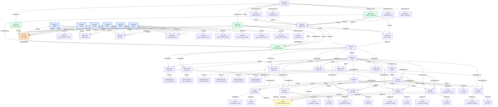

# Traceability Graph

```mermaid
flowchart TD
    RAW_001["RAW-001<br/>raw_input"]
    REQ_001["REQ-001<br/>requirement"]
    RU_001["RU-001<br/>requirement_unit"]
    RU_002["RU-002<br/>requirement_unit"]
    RU_003["RU-003<br/>requirement_unit"]
    GAP_001["GAP-001<br/>gap_report"]
    style GAP_001 fill:#ffdfba,stroke:#c2410c,stroke-width:2px
    DEC_001["DEC-001<br/>decision_log"]
    SEED_001["SEED-001<br/>identity_seed_bank"]
    style SEED_001 fill:#dcfce7,stroke:#15803d
    DISC_001["DISC-001<br/>discovery_log"]
    style DISC_001 fill:#dcfce7,stroke:#15803d
    DISC_002["DISC-002<br/>lens_review"]
    style DISC_002 fill:#dcfce7,stroke:#15803d
    DISC_003["DISC-003<br/>knowledge_ledger"]
    style DISC_003 fill:#dcfce7,stroke:#15803d
    DISC_004["DISC-004<br/>source_synthesis"]
    CHG_001["CHG-001<br/>change"]
    style CHG_001 fill:#dbeafe,stroke:#1d4ed8,stroke-width:2px
    DEC_002["DEC-002<br/>gap_resolution_report"]
    SEED_002["SEED-002<br/>identity_seed"]
    DEC_003["DEC-003<br/>decision"]
    REQ_002["REQ-002<br/>ears_requirement"]
    CHG_002["CHG-002<br/>change"]
    style CHG_002 fill:#dbeafe,stroke:#1d4ed8,stroke-width:2px
    DEC_004["DEC-004<br/>gap_resolution_report"]
    CHG_003["CHG-003<br/>change"]
    style CHG_003 fill:#dbeafe,stroke:#1d4ed8,stroke-width:2px
    DEC_005["DEC-005<br/>gap_resolution_report"]
    CHG_004["CHG-004<br/>change"]
    style CHG_004 fill:#dbeafe,stroke:#1d4ed8,stroke-width:2px
    DEC_006["DEC-006<br/>gap_resolution_report"]
    CHG_005["CHG-005<br/>change"]
    style CHG_005 fill:#dbeafe,stroke:#1d4ed8,stroke-width:2px
    DEC_007["DEC-007<br/>gap_resolution_report"]
    CHG_006["CHG-006<br/>change"]
    style CHG_006 fill:#dbeafe,stroke:#1d4ed8,stroke-width:2px
    DEC_008["DEC-008<br/>gap_resolution_report"]
    REQ_003["REQ-003<br/>project_brief"]
    PRD_001["PRD-001<br/>prd"]
    SPEC_001["SPEC-001<br/>spec"]
    SPEC_U_001["SPEC-U-001<br/>spec_unit"]
    REQ_EARS_001["REQ-EARS-001<br/>ears_requirement"]
    SPEC_U_002["SPEC-U-002<br/>spec_unit"]
    REQ_EARS_002["REQ-EARS-002<br/>ears_requirement"]
    SPEC_U_003["SPEC-U-003<br/>spec_unit"]
    REQ_EARS_003["REQ-EARS-003<br/>ears_requirement"]
    SPEC_U_004["SPEC-U-004<br/>spec_unit"]
    REQ_EARS_004["REQ-EARS-004<br/>ears_requirement"]
    SPEC_U_005["SPEC-U-005<br/>spec_unit"]
    REQ_EARS_005["REQ-EARS-005<br/>ears_requirement"]
    SPEC_U_006["SPEC-U-006<br/>spec_unit"]
    REQ_EARS_006["REQ-EARS-006<br/>ears_requirement"]
    EPIC_001["EPIC-001<br/>epic"]
    US_001["US-001<br/>user_story"]
    AC_001["AC-001<br/>acceptance_criteria"]
    US_002["US-002<br/>user_story"]
    AC_002["AC-002<br/>acceptance_criteria"]
    US_003["US-003<br/>user_story"]
    AC_003["AC-003<br/>acceptance_criteria"]
    US_004["US-004<br/>user_story"]
    AC_004["AC-004<br/>acceptance_criteria"]
    US_005["US-005<br/>user_story"]
    AC_005["AC-005<br/>acceptance_criteria"]
    US_006["US-006<br/>user_story"]
    AC_006["AC-006<br/>acceptance_criteria"]
    EPIC_002["EPIC-002<br/>epic"]
    US_007["US-007<br/>user_story"]
    AC_007["AC-007<br/>acceptance_criteria"]
    TC_001["TC-001<br/>test_case"]
    TC_002["TC-002<br/>test_case"]
    TC_003["TC-003<br/>test_case"]
    TC_004["TC-004<br/>test_case"]
    TC_005["TC-005<br/>test_case"]
    TC_006["TC-006<br/>test_case"]
    TC_007["TC-007<br/>test_case"]
    QA_001["QA-001<br/>backlog_readiness_audit"]
    style QA_001 fill:#fef9c3,stroke:#a16207
    RAW_001 -->|extracts| REQ_001
    RAW_001 -->|decomposes_into| RU_001
    RU_001 -->|analyzes| REQ_001
    RAW_001 -->|decomposes_into| RU_002
    RU_002 -->|analyzes| REQ_001
    RAW_001 -->|decomposes_into| RU_003
    RU_003 -->|analyzes| REQ_001
    REQ_001 -->|has_gap| GAP_001
    REQ_001 -->|requires_decision| DEC_001
    RAW_001 -->|produces_seed| SEED_001
    SEED_001 -->|grounds| REQ_001
    RAW_001 -->|analyzed_by| DISC_001
    DISC_001 -->|identifies| GAP_001
    RAW_001 -->|scrutinized_by| DISC_002
    DISC_002 -->|raises| GAP_001
    SEED_001 -->|consolidated_by| DISC_003
    GAP_001 -->|consolidated_by| DISC_003
    DEC_001 -->|consolidated_by| DISC_003
    DISC_002 -->|informs| DISC_003
    DISC_003 -->|grounds| REQ_001
    RAW_001 -->|summarized_by| DISC_004
    DISC_004 -->|grounds| REQ_001
    CHG_001 -->|produces| DEC_002
    CHG_001 -->|resolves| GAP_001
    CHG_001 -->|confirms| SEED_002
    CHG_001 -->|confirms| DEC_003
    CHG_001 -->|normalizes| REQ_002
    DISC_002 -->|consolidated_by| DISC_003
    CHG_002 -->|produces| DEC_004
    CHG_002 -->|resolves| GAP_001
    CHG_002 -->|confirms| SEED_002
    CHG_002 -->|confirms| DEC_003
    CHG_002 -->|normalizes| REQ_002
    CHG_003 -->|produces| DEC_005
    CHG_003 -->|resolves| GAP_001
    CHG_003 -->|confirms| SEED_002
    CHG_003 -->|confirms| DEC_003
    CHG_003 -->|normalizes| REQ_002
    CHG_004 -->|produces| DEC_006
    CHG_004 -->|resolves| GAP_001
    CHG_004 -->|confirms| SEED_002
    CHG_004 -->|confirms| DEC_003
    CHG_004 -->|normalizes| REQ_002
    CHG_005 -->|produces| DEC_007
    CHG_005 -->|resolves| GAP_001
    CHG_005 -->|confirms| SEED_002
    CHG_005 -->|confirms| DEC_003
    CHG_005 -->|normalizes| REQ_002
    CHG_006 -->|produces| DEC_008
    CHG_006 -->|resolves| GAP_001
    CHG_006 -->|confirms| SEED_002
    CHG_006 -->|confirms| DEC_003
    CHG_006 -->|normalizes| REQ_002
    REQ_001 -->|crystallizes| REQ_003
    SEED_001 -->|grounds| REQ_003
    DISC_002 -->|informs| REQ_003
    REQ_001 -->|elaborates| PRD_001
    REQ_003 -->|elaborates| PRD_001
    PRD_001 -->|agentizes| SPEC_001
    PRD_001 -->|decomposes| SPEC_U_001
    SPEC_001 -->|indexes| SPEC_U_001
    SPEC_U_001 -->|traces_to| REQ_EARS_001
    PRD_001 -->|decomposes| SPEC_U_002
    SPEC_001 -->|indexes| SPEC_U_002
    SPEC_U_002 -->|traces_to| REQ_EARS_002
    PRD_001 -->|decomposes| SPEC_U_003
    SPEC_001 -->|indexes| SPEC_U_003
    SPEC_U_003 -->|traces_to| REQ_EARS_003
    PRD_001 -->|decomposes| SPEC_U_004
    SPEC_001 -->|indexes| SPEC_U_004
    SPEC_U_004 -->|traces_to| REQ_EARS_004
    PRD_001 -->|decomposes| SPEC_U_005
    SPEC_001 -->|indexes| SPEC_U_005
    SPEC_U_005 -->|traces_to| REQ_EARS_005
    PRD_001 -->|decomposes| SPEC_U_006
    SPEC_001 -->|indexes| SPEC_U_006
    SPEC_U_006 -->|traces_to| REQ_EARS_006
    SPEC_001 -->|decomposes_to| EPIC_001
    EPIC_001 -->|contains| US_001
    SPEC_001 -->|decomposes_to| US_001
    SPEC_U_001 -->|decomposes_to| US_001
    US_001 -->|validated_by| AC_001
    EPIC_001 -->|contains| US_002
    SPEC_001 -->|decomposes_to| US_002
    SPEC_U_002 -->|decomposes_to| US_002
    US_002 -->|validated_by| AC_002
    EPIC_001 -->|contains| US_003
    SPEC_001 -->|decomposes_to| US_003
    SPEC_U_003 -->|decomposes_to| US_003
    US_003 -->|validated_by| AC_003
    EPIC_001 -->|contains| US_004
    SPEC_001 -->|decomposes_to| US_004
    SPEC_U_004 -->|decomposes_to| US_004
    US_004 -->|validated_by| AC_004
    EPIC_001 -->|contains| US_005
    SPEC_001 -->|decomposes_to| US_005
    SPEC_U_005 -->|decomposes_to| US_005
    US_005 -->|validated_by| AC_005
    EPIC_001 -->|contains| US_006
    SPEC_001 -->|decomposes_to| US_006
    SPEC_U_006 -->|decomposes_to| US_006
    US_006 -->|validated_by| AC_006
    SPEC_001 -->|decomposes_to| EPIC_002
    EPIC_002 -->|contains| US_007
    US_007 -->|enables| US_001
    US_007 -->|enables| US_002
    US_007 -->|enables| US_003
    US_007 -->|enables| US_004
    US_007 -->|enables| US_005
    US_007 -->|enables| US_006
    SPEC_001 -->|decomposes_to| US_007
    US_007 -->|validated_by| AC_007
    US_001 -->|covered_by| TC_001
    US_002 -->|covered_by| TC_002
    US_003 -->|covered_by| TC_003
    US_004 -->|covered_by| TC_004
    US_005 -->|covered_by| TC_005
    US_006 -->|covered_by| TC_006
    US_007 -->|covered_by| TC_007
    US_001 -->|audited_by| QA_001
    US_002 -->|audited_by| QA_001
    US_003 -->|audited_by| QA_001
    US_004 -->|audited_by| QA_001
    US_005 -->|audited_by| QA_001
    US_006 -->|audited_by| QA_001
    US_007 -->|audited_by| QA_001
```
